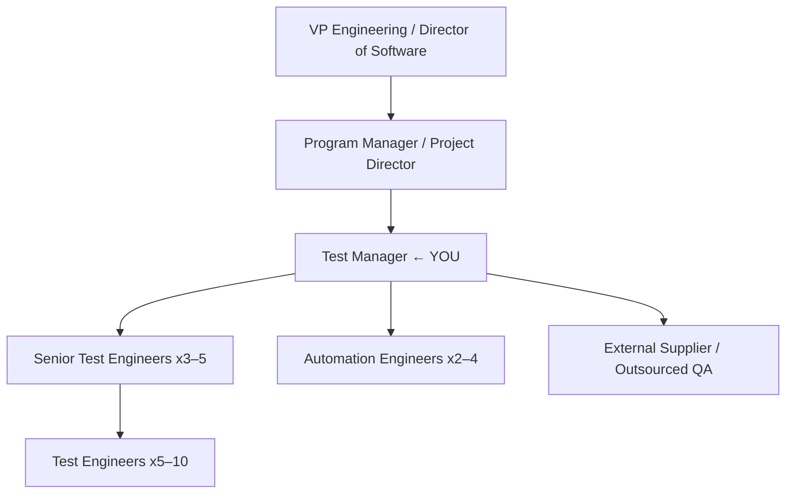
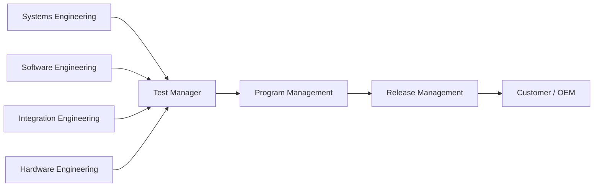
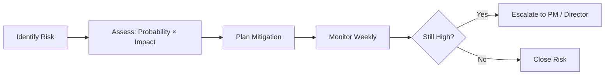
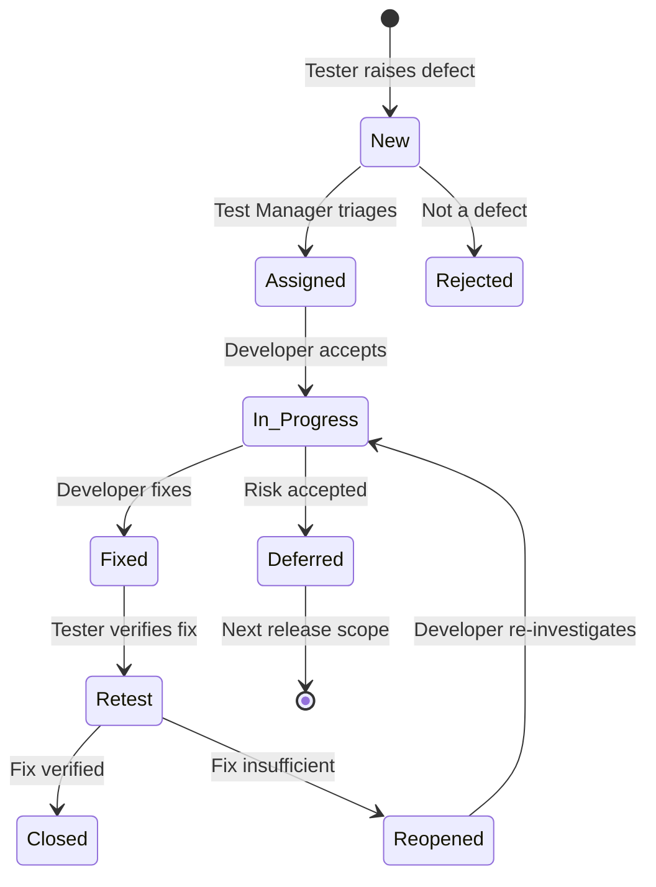
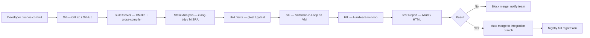

# Automotive Test Manager Interview Master Guide
### Senior Engineering Manager Playbook — 7-Year Validation Engineer → Manager Transition
#### Target: Harman · Bosch · Mercedes-Benz R&D · Qualcomm Automotive · Continental · Aptiv · Visteon · Tata Technologies · Mahindra · Hyundai MOBIS · Valeo · KPIT · LG Electronics VS · Marelli · Stellantis

---

> **How to use this guide:** Read it like a technical playbook, not a textbook. Every section includes real-world examples, interview traps, and model answers drawn from actual Tier-1 and OEM hiring practices. Highlight sections relevant to your background and personalise examples before your interview.

---

# TABLE OF CONTENTS

| Section | Title | Page Equiv. |
|---|---|---|
| 1 | Role of an Automotive Test Manager | 1 |
| 2 | Day-to-Day Activities | 2 |
| 3 | Technical Knowledge | 3 |
| 4 | Test Management | 4 |
| 5 | Test Automation | 5 |
| 6 | Leadership Skills | 6 |
| 7 | Project Management | 7 |
| 8 | Metrics and KPIs | 8 |
| 9 | Five Detailed Case Studies | 9 |
| 10 | Twenty STAR Behavioral Questions | 10 |
| 11 | 150+ Manager Interview Q&A | 11 |
| 12 | Executive Communication Templates | 12 |
| 13 | 30/60/90-Day Success Plan | 13 |

---

# SECTION 1 — Role of an Automotive Test Manager

## 1.1 Who You Are

An Automotive Test Manager owns the **quality gate** between engineering and the customer. You are not the best tester on the team—you are the person who builds the environment in which the best testing happens. You translate business risk into test strategy, engineering effort into management visibility, and defect data into release decisions.

At companies like Harman and Visteon, the Test Manager title may be **Software Validation Manager**. At Bosch it is often **Testing Lead — ADAS/Cockpit**. At Continental it could be **V&V Manager**. The role is identical in substance:

> You own **what gets tested**, **who tests it**, **when it is done**, and **whether the product ships**.

---

## 1.2 Reporting Hierarchy



In a **matrix organisation** (common at Bosch, Continental, Aptiv), you report to a functional engineering manager for headcount and HR, and to a program manager for delivery. Managing both relationships is a key skill.

---

## 1.3 Organisation Structure — Infotainment / Digital Cockpit Program



---

## 1.4 Ownership Boundaries

| What you OWN | What you INFLUENCE | What you ESCALATE |
|---|---|---|
| Test strategy and plan | Software architecture decisions | Customer-impacting defect waivers |
| Test entry/exit criteria | Requirement completeness | Release date changes |
| Defect triage and prioritisation | CI/CD toolchain | Resource budget decisions |
| Team performance and growth | Supplier quality standards | Safety waivers (ISO 26262) |
| Automation coverage targets | Development process (ASPICE) | Cross-program resource conflicts |
| Release readiness sign-off | Hardware availability | Legal/regulatory deviations |

---

## 1.5 Core Responsibilities

### Daily
- Review overnight test run results; assign defect owners before morning stand-up.
- Clear blockers for the testing team (environment, hardware, access).
- Scan customer and escalation emails; flag within 2 hours.
- Update test execution dashboard.

### Weekly
- Publish **weekly status report** to program manager and customer.
- Conduct defect review triage meeting (15–30 mins).
- One-on-one with each senior engineer (rotating schedule).
- Review automation run trends (pass rate delta, flaky test count).
- Update risk register.

### Monthly
- Publish **metrics digest** (defect density, automation %, coverage, MTTR).
- Conduct team retrospective.
- Review hiring pipeline and capacity plan.
- Present to program management forum.

### Quarterly
- Update test strategy for next release milestone.
- Conduct performance reviews (mid-cycle feedback).
- ASPICE audit preparation or participation.
- Technology investment proposals (tool upgrades, automation stack).

---

## 1.6 Cross-Functional Collaboration

| Partner | Typical Interaction | Frequency |
|---|---|---|
| Software Engineering | Defect root cause, build hand-off, feature completeness | Daily |
| Systems Engineering | Requirements clarification, change impact | Weekly |
| Hardware Engineering | Bench availability, hardware defects | Weekly |
| Program Manager | Release status, risk, milestones | 2× per week |
| Customer / OEM | Test evidence, open issues, waivers | Weekly / as needed |
| Functional Safety Manager | ISO 26262 test evidence, FMEA input | Monthly |
| Cybersecurity Engineer | Penetration test coordination | Per release |
| Supplier / Outsource | Work package delivery, quality check | Daily during surge |

---

## 1.7 Working with OEMs

OEMs (Mercedes, Stellantis, Hyundai, GM) do not trust certification documents — they trust **test evidence**. Key rules:

1. Every test verdict has a **traceability ID** back to a requirement.
2. Every test environment has a **hardware and software configuration record**.
3. Deviations are not accepted verbally — document a waiver with risk justification.
4. Customer test reviews require **pre-reads** 48 hours before the meeting.
5. Never say "it will be fixed in the next build" unless you have a commit hash.

---

## 1.8 Risk Management



**Risk Register template (minimum columns):**

| Risk ID | Description | Probability | Impact | Score | Owner | Mitigation | Status |
|---|---|---|---|---|---|---|---|
| R-001 | Camera ECU firmware not available for T−4 weeks | High | High | 9 | HW Lead | Use HIL model | Open |
| R-002 | Automation framework migration blocked on Python 3.12 | Medium | Medium | 4 | AT Lead | Parallel run on legacy | Mitigated |

---

## 1.9 Resource Planning

**Planning formula (used at Harman and Visteon programs):**

```
Total Effort = (Number of Test Cases × Average Execution Time)
             + (Defect Investigation Time × Expected Defect Count)
             + (Automation Build Time)
             + (Meetings + Reporting: 20–25% overhead)
```

Always plan for **20–30% buffer** for unplanned escalations, environment instability, and late requirement changes — these happen on every automotive program.

---

# SECTION 2 — Day-to-Day Activities

## 2.1 Realistic Workday — Test Manager, Infotainment Program

### 08:00 — Morning Prep (30 min)
- Scan email: customer escalations first, then build failure alerts, then internal.
- Open CI/CD dashboard: check overnight regression suite pass rate.
- If pass rate dropped > 5%, send a one-liner to the team Slack/Teams channel before stand-up.
- Review the day's calendar; block focus time if critical decision needed.

### 08:30 — Daily Stand-up (15 min, crisp)
Format: What did you complete? What are you doing today? Any blocker?

Your role in stand-up: **do not solve problems here**. Capture blockers and resolve offline. If a team member has been blocked for > 24 hours, that is a management failure.

### 09:00 — Defect Review (Tue/Thu, 30 min)
- Open JIRA / ALM board filtered to: Priority = P1/P2, Status = Open/In Progress.
- For each P1: Is it assigned? Is there an ETA? Is the customer aware?
- For each P2: Age > 5 days? Escalate to developer's lead.
- Record decisions; close the meeting in 30 minutes — no exceptions.

### 09:30 — Test Planning / Estimation Work
- Write or review test cases for next sprint.
- Update requirement traceability matrix (RTM).
- Validate that new features have test coverage before developer check-in.

### 10:30 — Sprint Planning (Monday only, 60–90 min)
- Pull team capacity (subtract leave, meetings, overhead).
- Select user stories from backlog; confirm acceptance criteria are testable.
- Assign to engineers based on skills; cross-train where possible.
- Confirm automation candidate identification per story.

### 11:30 — Architecture / Design Review
- Attend key design reviews — not to approve but to identify testability issues early.
- Ask: "How will we verify this at system level?"
- Flag missing interfaces, unclear error conditions, or untestable requirements.

### 12:00 — Lunch (do not skip; it signals team norms)

### 13:00 — Customer / OEM Call
- Prepare 3-slide summary: (1) Test progress, (2) Open defects, (3) Risk.
- Never surprise customers on calls. Send the pre-read 24 hours before.
- Listen more than you talk. Capture action items; send minutes within 2 hours.

### 14:00 — One-on-Ones (2–3 per week, 30 min each)
Structure: 10 min them, 10 min feedback, 10 min coaching/career.
Do not fill this with project status — that belongs in stand-up.

### 14:30 — Automation Backlog Review
- Review what is being automated vs. manual backlog size.
- Check CI run stability (flaky test count < 2% target).
- Unblock automation engineers from environment or toolchain issues.

### 15:30 — Escalation / Incident Management
- P0 defects trigger an **incident response**: dedicated Slack channel, 30-min sync, hourly updates to stakeholders until resolved or workaround in place.
- Your job: coordinate, not debug. Ask: what do you need to fix this faster?

### 16:30 — Reporting
- Update program dashboard (defect metrics, execution progress, automation %).
- Prepare weekly status draft if Friday is tomorrow.
- Review release readiness checklist — is the team on track for the exit criteria?

### 17:00 — Strategic Work (30 min uninterrupted)
- Process improvements, hiring decisions, tool evaluations.
- This time disappears if you do not protect it.

### 17:30 — Plan Tomorrow
- Block 3 must-do items in your calendar for tomorrow morning.
- Notify team of any upcoming dependencies or hand-offs.

### 18:00 — Wind-down / Emergency only after
- If an overnight test run is critical, configure automated Slack alerts — do not stay until 22:00 watching a dashboard.

---

# SECTION 3 — Technical Knowledge

## 3.1 Automotive Communication Protocols

### CAN (Controller Area Network)

**What a Test Manager must know (not a developer, but a validator):**

| Attribute | Details |
|---|---|
| Speed | Classic CAN: up to 1 Mbit/s; CAN FD: up to 8 Mbit/s data phase |
| Frame types | Data, Remote, Error, Overload |
| Identifier | 11-bit (Standard) or 29-bit (Extended) |
| Max payload | 8 bytes (Classic), 64 bytes (CAN FD) |
| Error handling | CRC, bit stuffing, ACK, error frames |
| Tools | CANoe, CANalyzer, PCAN, Vector hardware |

**Test Manager perspective:** You validate CAN by checking signal accuracy (range, resolution, cycle time), error frame rate, bus load, and signal timeout behaviour. Use a DBC file to define signals and verify against OEM specifications.

**Interview question:** *"How do you validate that a CAN signal is within specification?"*
Answer: Use CANoe with the DBC file. Write a CAPL script that reads signal values over 1000 cycles, checks for range violations, measures cycle time deviation, and logs results. Compare to ICD (Interface Control Document) values.

---

### CAN FD

Extension of CAN supporting variable data length (up to 64 bytes) and a two-phase bit rate. The arbitration phase runs at classic CAN speed; the data phase runs at higher speed. Test focus: bit-rate switching, payload validity, backward compatibility with CAN gateways.

---

### LIN (Local Interconnect Network)

Single-master multi-slave, 20 kbit/s, low-cost. Common in body electronics (windows, mirrors, seats). Test focus: schedule table compliance, checksum variants (classic vs. enhanced), sleep/wake-up behaviour.

---

### FlexRay

Deterministic, time-triggered, up to 10 Mbit/s on two channels. Used in safety-critical applications (active suspension, brake-by-wire). Nearly replaced by CAN FD + Ethernet in modern platforms. Know it for legacy programs.

---

### Automotive Ethernet (100BASE-T1, 1000BASE-T1)

100 Mbit/s and 1 Gbit/s over a single unshielded twisted pair. The backbone of zonal E/E architecture. Test focus: bandwidth utilisation, latency, Quality of Service (QoS), VLAN tagging, switch configuration.

---

### SOME/IP (Scalable service-Oriented MiddlewarE over IP)

Service-oriented communication for AUTOSAR Adaptive and connected services.

| Concept | Meaning |
|---|---|
| Method | Request/response (like RPC) |
| Event | Fire-and-forget notification |
| Field | Getter/setter with notification |
| Service Discovery | Dynamic service announcement |

**Test approach:** Use Wireshark with the SOME/IP dissector, or Elektrobit EB Guide Test, or a Python script using the `someip` library to simulate a service consumer/provider.

---

### DDS (Data Distribution Service)

Middleware standard used in AUTOSAR Adaptive and ADAS platforms. Publish-subscribe model with Quality of Service profiles. Test tools: RTI Connext DDS, Eclipse Cyclone DDS spy tools.

---

### UDS (Unified Diagnostic Services — ISO 14229)

The diagnostic protocol used by all OEM service tools.

| Service | Code | Purpose |
|---|---|---|
| DiagnosticSessionControl | 0x10 | Switch between default, extended, programming sessions |
| ECUReset | 0x11 | Hard/soft reset |
| SecurityAccess | 0x27 | Seed/key authentication for protected services |
| ReadDataByIdentifier | 0x22 | Read DID values (VIN, SW version, sensor data) |
| WriteDataByIdentifier | 0x2E | Write calibration data |
| InputOutputControlByIdentifier | 0x2F | Override actuators for test |
| RoutineControl | 0x31 | Execute routines (flash erase, self-test) |
| RequestDownload | 0x34 | Start software download |
| TransferData | 0x36 | Transfer firmware blocks |
| CommunicationControl | 0x28 | Enable/disable CAN Tx/Rx |
| ReadDTCInformation | 0x19 | Read Diagnostic Trouble Codes |
| ClearDiagnosticInformation | 0x14 | Clear DTCs |
| TesterPresent | 0x3E | Keep session alive |

**Test Manager perspective:** Define UDS test cases covering positive responses, negative responses (NRC codes), session transitions, security access pass/fail, and DTC lifecycle (pending, confirmed, aged, cleared).

---

### OBD-II (SAE J1979 / ISO 15031)

Standardised emission-related diagnostic interface. Modes 01–0A. The Test Manager ensures the ECU reports correct PIDs and DTCs for regulatory compliance.

---

### ISO-TP (ISO 15765-2)

Transport layer for UDS over CAN. Handles segmentation and reassembly for messages > 8 bytes. Test focus: First Frame / Consecutive Frame / Flow Control sequences, STmin timing, block size.

---

### DoIP (Diagnostics over IP — ISO 13400)

UDS tunnelled over Ethernet. Used for high-bandwidth programming (OTA) and in connected vehicle architectures. Test focus: vehicle announcement, activation request, routing activation, diagnostic message routing.

---

## 3.2 AUTOSAR

### Classic AUTOSAR

**Layered architecture:**

```
Application Layer    — SWC (Software Components)
Runtime Environment  — RTE (generated glue code)
Basic Software Layer — COM, MCAL, BSW modules
Microcontroller      — Target ECU hardware
```

**Test Manager concern:** Ensure SWC port interfaces, calibration data (CData), and inter-SWC communication are tested. ARXML files define the architecture — a change to an ARXML requires re-run of affected integration tests.

**AUTOSAR COM test points:**
- Signal values transmitted/received correctly.
- Timeout supervision (signal not received → DTC triggered).
- Gateway routing (signal mapped from CAN to Ethernet).
- E2E protection (CRC, sequence counter).

### Adaptive AUTOSAR

Used in domain/zone controllers running on high-performance SoCs (NVIDIA Drive, Qualcomm SA8xxx, Renesas R-Car).

Key differences from Classic:
- POSIX OS (QNX, Linux), not OSEK.
- Dynamic service binding via SOME/IP.
- ara::com, ara::exec, ara::diag APIs.
- Applications are Adaptive Application executables, not SWCs in BSW.

**Test approach for Adaptive:** End-to-end service tests using SOME/IP clients, lifecycle state machine validation (Init → Running → Terminating), and diagnostic testing via DoIP.

---

## 3.3 Operating Systems

### QNX Neutrino

Real-time microkernel OS used in safety-critical automotive systems (Blackberry QNX). Key properties:
- POSIX-compliant.
- Microkernel: OS services run as user-space processes.
- Deterministic scheduling: FIFO, round-robin, sporadic.
- Memory partitioning for freedom from interference.

**Test Manager concern:** Validate timing budgets, memory partition isolation, watchdog behaviour, and safe-state transitions.

### Android Automotive OS (AAOS)

Google's automotive-specific Android distribution. Used in IVI systems at Mercedes, GM, Volvo, Renault.

**Test focus areas for Android Automotive:**
- Boot time (cold boot < OEM target, e.g. < 4 seconds for cluster).
- Audio focus management (navigation, phone, media, emergency alert priority).
- Vehicle HAL (VHAL) property handling.
- Display management (multi-display, split screen, privacy mode).
- OTA update (A/B seamless update, rollback verification).
- Google app certification (GAS — Google Automotive Services).
- CDD/CTS compliance (Compatibility Test Suite).
- Security model (SELinux policies, multi-user, sandboxing).

### Embedded Linux (Yocto / AGL)

Used in telematics units, domain controllers, and some IVI systems. Test focus: kernel module testing, device driver validation, NetworkManager, systemd service lifecycle.

---

## 3.4 Automotive Domains

### Instrument Cluster / Digital Cluster
- Displays speed, RPM, fuel, warning lamps, ADAS indicators.
- Safety-relevant (ISO 26262 ASIL-B minimum for speed display).
- Test focus: warning lamp accuracy, CAN signal decoding, brightness/contrast, bootup graphic, power cycle stability.

### HUD (Head-Up Display)
- Projects information onto windshield.
- Test focus: pixel accuracy, brightness adaptation, alignment calibration, latency.

### IVI (In-Vehicle Infotainment)
- Central touchscreen, audio, navigation, connectivity.
- High complexity: Android/QNX dual-OS, multiple ECU interactions.
- Test focus: boot time, audio quality, Bluetooth/Wi-Fi stability, navigation accuracy, voice recognition, app lifecycle.

### Telematics / TCU (Telematics Control Unit)
- 4G/5G modem, GNSS, OTA.
- Test focus: cellular connectivity, GNSS fix time and accuracy, OTA package validation, remote diagnostics.

### ADAS
- Camera, radar, ultrasonic, lidar sensor validation.
- AEB, ACC, LKA, BSMD, parking assistance.
- Test focus: sensor calibration verification, object detection accuracy, functional safety boundary conditions, fault injection.

---

## 3.5 Functional Safety — ISO 26262

**What a Test Manager must understand:**

| Term | Meaning |
|---|---|
| ASIL | Automotive Safety Integrity Level (QM, A, B, C, D — D = most critical) |
| HARA | Hazard Analysis and Risk Assessment |
| Safety Goal | Top-level safety requirement derived from HARA |
| FSR | Functional Safety Requirement |
| TSR | Technical Safety Requirement |
| Safety Case | Complete argument that the item is sufficiently safe |
| Confirmation Measure | Independence review: software safety audit, FMEA, FTA |

**Test Manager role in ISO 26262:**
- Ensure every safety requirement (FSR/TSR) has a test case.
- Maintain independence between developer and tester (especially ASIL-C/D).
- Produce test reports as part of the safety case work products.
- Participate in safety audits (internal, customer, TÜV).
- Understand fault injection: the safety mechanism must detect and react to hardware faults.

---

## 3.6 Cybersecurity — ISO/SAE 21434

Automotive cybersecurity standard. As Test Manager:
- Validate cybersecurity controls identified in TARA (Threat Analysis and Risk Assessment).
- Coordinate penetration testing (white-box by team, black-box by external firm).
- Validate secure boot, secure OTA, certificate management, key storage.
- Ensure no hardcoded credentials in delivered software.

---

## 3.7 ASPICE (Automotive SPICE)

Software process assessment framework used by German OEMs (VW, BMW, Mercedes). Key processes for Test Manager:

| Process | ID | Content |
|---|---|---|
| Software Testing | SWE.6 | Unit test, integration test, system test |
| System Testing | SYS.4 | System integration and qualification test |
| Software Build | SWE.5 | Build and integration |
| Requirements Management | SYS.2/SWE.1 | Requirement traceability |
| Problem Resolution | SUP.9 | Defect management |
| Change Request | SUP.10 | Change management |

**ASPICE assessment levels:** Level 1 (Performed) → Level 2 (Managed) → Level 3 (Established). Most OEMs require Tier-1 suppliers at Level 2; some require Level 3 for safety-critical products.

**Test Manager must demonstrate for ASPICE SWE.6:**
- Test strategy defined and reviewed.
- Test cases derived from requirements (traceability).
- Regression test suite maintained.
- Defect management process followed.
- Test environment documented.
- Test results reviewed and approved.

---

# SECTION 4 — Test Management

## 4.1 Test Strategy

A test strategy answers: **what, how much, by when, with what, and at what level**.

**Structure of a Test Strategy Document:**

```
1. Scope and Objectives
2. Test Levels (Unit, Integration, System, Acceptance)
3. Test Types (Functional, Performance, Regression, Security, OTA)
4. Test Environments (SIL, HIL, vehicle bench, target hardware)
5. Entry and Exit Criteria
6. Tools and Infrastructure
7. Automation Strategy
8. Risk-Based Test Prioritisation
9. Defect Management Process
10. Metrics and Reporting
11. Resource Plan
12. Schedule
```

**Interview tip:** When asked "walk me through your test strategy," use this structure. Tailor the emphasis to the domain: for an infotainment role, weight automation and Android testing heavily; for ADAS, weight HIL and safety validation.

---

## 4.2 Test Planning

Test planning converts the test strategy into an executable schedule with assigned resources.

**Key inputs:**
- Requirements specification / feature list.
- System architecture document.
- Project schedule / milestones.
- Team capacity.

**Test Plan document sections:**
1. Introduction and references.
2. Features to be tested.
3. Features not to be tested (with rationale).
4. Approach (risk-based, requirement-based, boundary).
5. Pass/fail criteria.
6. Suspension criteria (e.g., build pass rate < 80%).
7. Test deliverables.
8. Resource allocation.
9. Schedule.
10. Risks and contingencies.

---

## 4.3 Effort Estimation

### Three-Point Estimation

$$E = \frac{Optimistic + 4 \times MostLikely + Pessimistic}{6}$$

**Example:** Writing and executing 200 test cases:
- Optimistic: 10 days (everything ready, no defects).
- Most Likely: 18 days (normal integration issues).
- Pessimistic: 30 days (late builds, hardware issues).
- Estimate: (10 + 4×18 + 30) / 6 = **19 days**.

Always add management buffer (20%) and risk buffer (10–15%) separately so stakeholders see the rationale.

---

## 4.4 Requirement Traceability Matrix (RTM)

The RTM is the single most important quality artifact in an automotive program.

| Requirement ID | Requirement Description | Test Case ID | Test Status | Defect ID | Notes |
|---|---|---|---|---|---|
| REQ-IVI-001 | IVI shall boot within 5 s of ignition ON | TC-001, TC-002 | Passed | — | Avg 3.8 s |
| REQ-IVI-002 | Navigation shall lock GPS within 30 s cold start | TC-015 | Failed | BUG-4521 | Open P1 |
| REQ-IVI-003 | Volume knob shall adjust in ±1 dB steps | TC-030 | Not Run | — | Blocked: HW |

**ASPICE requirement:** 100% of requirements must be covered in the RTM. Untested requirements must have an explicit risk-accepted waiver.

---

## 4.5 Entry and Exit Criteria

### Entry Criteria (before testing starts)
- Test environment set up and verified.
- Build deployed and smoke test passed.
- Test data and DBC/ARXML files loaded.
- All P0/P1 blocking defects from previous cycle resolved.
- Test cases reviewed and approved.

### Exit Criteria (before release)
- All planned test cases executed.
- Zero open P0 defects.
- P1 defects: < N open (agreed with PM and customer, e.g., < 3 with mitigations).
- Requirement traceability: 100% coverage.
- Automation pass rate ≥ 95%.
- Customer sign-off received.

---

## 4.6 Defect Lifecycle



### Severity vs. Priority Matrix

| | High Priority | Low Priority |
|---|---|---|
| **High Severity** | Fix immediately (P1/S1) — Safety / legal / complete failure | Fix in this sprint (P2/S1) — Functional but rarely triggered |
| **Low Severity** | Fix this release (P1/S2) — Cosmetic but on critical screen | Defer to backlog (P3/S3) — Minor, low user impact |

**Interview tip:** Always distinguish Severity (impact on system) from Priority (urgency to fix). A typo on a legal disclaimer screen is Low Severity but may be High Priority. A crash in a rarely used menu is High Severity but Low Priority.

---

## 4.7 Test Types — Automotive Context

### Functional Testing
Verifies system behaves per specification. "Does the navigation route to the correct destination?"

### Performance Testing
Validates timing and throughput. Automotive targets:
- Boot time: < 2 s cluster display, < 4 s full IVI ready.
- CAN signal latency: < 10 ms.
- Audio output delay: < 50 ms from button press.
- OTA download: within carrier speed limits.

### Stability / Soak Testing
Run the system continuously for 24–72 hours (or more for premium programs) with scripted scenarios. Capture memory leaks, CPU spikes, log file overflow, and kernel crashes.

### Regression Testing
Ensures previously passing tests continue to pass after new code changes. Strategy:
- **Full regression:** Before major release.
- **Selective regression:** After bug fix — run tests related to changed modules.
- **Automated regression:** Nightly CI runs; results reviewed next morning.

### Compatibility Testing
Test across hardware variants (suppliers, board revisions) and software configurations (market variants, language packs, optional feature sets).

### Exploratory Testing
Unscripted testing by experienced testers. Especially valuable for ADAS and UX scenarios. Time-box it (2-hour sessions), record findings in a session log.

### Negative Testing / Boundary Testing
- Input values at boundary (min, max, min–1, max+1).
- Invalid CAN signals (out-of-range, wrong cycle time, missing).
- Power interruption at critical moments.
- Network cable unplugged during OTA.
- User gesture at extreme speed (rapid swipes, multi-finger while navigating).

---

# SECTION 5 — Test Automation

## 5.1 Automation Strategy Principles

1. **Automate regression, not exploration.** Scripts excel at repetition; humans excel at finding novel bugs.
2. **Automate the stable, not the changing.** Features under active development waste automation investment.
3. **Measure automation ROI.** Automation is worth it when: manual execution time × frequency > automation build + maintenance time.
4. **Treat test code as production code.** Code review, version control, coding standards.
5. **Build the pyramid, not the ice cream cone.**

```
       /\
      /  \   E2E / System Tests (10–15%)
     /----\
    / Int  \  Integration Tests (25–35%)
   /--------\
  / Unit     \  Unit Tests (50–65%)
 /------------\
```

---

## 5.2 Python Automation — Automotive Testing

### Framework Stack (used at Harman, Bosch, Visteon)

```
pytest           → Test runner and assertion framework
Robot Framework  → Keyword-driven acceptance tests
python-can       → CAN bus interaction
paramiko         → SSH to target ECU
requests         → REST API testing (AAOS, telematics)
Allure           → HTML reporting
Jenkins          → CI/CD execution
Docker           → Test environment isolation
```

### Sample pytest Structure

```python
# tests/test_ivi_boot.py
import pytest
import time
from automotive.can_bus import CanBus
from automotive.serial_console import SerialConsole

@pytest.fixture(scope="session")
def can_bus():
    bus = CanBus(channel="can0", bitrate=500000)
    yield bus
    bus.shutdown()

class TestBootTime:
    """IVI boot time validation — REQ-IVI-001"""

    def test_cold_boot_within_5s(self, can_bus):
        """
        Requirement: IVI shall display home screen within 5 s of IGN_ON.
        Precondition: Vehicle in power-off state.
        """
        can_bus.send_ignition_on()
        start = time.monotonic()

        # Poll for HomeScreen ready signal on CAN (IVI_Status = 0x03)
        timeout = 8.0
        while time.monotonic() - start < timeout:
            msg = can_bus.receive(timeout=0.1)
            if msg and msg.arbitration_id == 0x4A0:
                if msg.data[0] == 0x03:  # HOME_SCREEN_READY
                    elapsed = time.monotonic() - start
                    assert elapsed <= 5.0, f"Boot took {elapsed:.2f}s, limit 5.0s"
                    return
        pytest.fail("IVI_Status HOME_SCREEN_READY not received within 8 s timeout")

    @pytest.mark.parametrize("cycle", range(5))
    def test_warm_boot_consistency(self, can_bus, cycle):
        """Warm boot shall consistently be within 3 s."""
        can_bus.send_ignition_off()
        time.sleep(2)
        can_bus.send_ignition_on()
        start = time.monotonic()
        # ... same polling logic
```

---

## 5.3 Robot Framework — Keyword-Driven

```robot
*** Settings ***
Library    AutomotiveLibrary
Library    Collections

*** Variables ***
${CAN_CHANNEL}    can0
${BOOT_TIMEOUT}   5.0

*** Test Cases ***
IVI Cold Boot Within 5 Seconds
    [Documentation]    Verifies REQ-IVI-001
    [Tags]    boot    regression    critical
    Send Ignition ON    ${CAN_CHANNEL}
    ${elapsed}=    Wait For IVI Status    HOME_SCREEN_READY    ${BOOT_TIMEOUT}
    Should Be Less Than    ${elapsed}    ${BOOT_TIMEOUT}
    Log    Boot time: ${elapsed} seconds

Navigation GPS Lock Under 30 Seconds
    [Documentation]    Verifies REQ-IVI-002
    [Tags]    navigation    gps    regression
    Enable Navigation Module
    ${fix_time}=    Wait For GPS Fix    30.0
    Should Be Less Than    ${fix_time}    30.0
    Log    GPS fix time: ${fix_time} seconds
```

---

## 5.4 CAPL (Communication Access Programming Language)

CAPL scripts run inside CANoe/CANalyzer. Essential skill for automotive test engineers.

```capl
/*
 * adas_aeb_validation.can
 * Validates AEB (Autonomous Emergency Braking) activation via CAN signals.
 * Requirements: REQ-ADAS-AEB-001, REQ-ADAS-AEB-002
 */

variables {
    message AEB_Status aebMsg;
    timer tTimeout;
    float g_ttc_threshold = 1.5;  // seconds
    int g_test_passed = 0;
}

on start {
    write("=== AEB Validation Test Started ===");
    // Simulate close-range obstacle: TTC = 1.2 s (below threshold)
    $ADAS_LeadRange_m = 12.0;
    $ADAS_EgoSpeed_kph = 60.0;
    $ADAS_LeadRelSpeed_mps = -20.0;
    setTimer(tTimeout, 2000);  // 2-second test window
    write("Simulated TTC: %.2f s", 12.0 / 20.0);
}

on signal ADAS_AEB_Request {
    if (this == 1) {
        write("AEB request received. TTC was %.2f s", $ADAS_LeadRange_m / abs($ADAS_LeadRelSpeed_mps));
        cancelTimer(tTimeout);
        g_test_passed = 1;
        write("TEST PASSED: AEB activated below TTC threshold");
        stop();
    }
}

on timer tTimeout {
    if (!g_test_passed) {
        write("TEST FAILED: AEB not activated within 2 s. TTC threshold missed.");
        stop();
    }
}

on signal ADAS_Cmd_Acceleration_mps2 {
    if (this <= -4.0 && g_test_passed) {
        write("TEST PASSED: AEB deceleration %.2f m/s² (requirement: <= -4.0)", this);
    }
}
```

---

## 5.5 CI/CD Pipeline — Automotive Test



**Jenkins pipeline snippet (Jenkinsfile):**

```groovy
pipeline {
    agent { label 'automotive-test-node' }
    stages {
        stage('Build') {
            steps {
                sh 'cmake -S . -B build -DCMAKE_BUILD_TYPE=Release'
                sh 'cmake --build build --parallel 8'
            }
        }
        stage('Static Analysis') {
            steps {
                sh 'clang-tidy src/**/*.cpp -- -I include'
            }
        }
        stage('Unit Tests') {
            steps {
                sh 'ctest --test-dir build --output-junit unit_results.xml'
                junit 'unit_results.xml'
            }
        }
        stage('SIL Regression') {
            steps {
                sh 'pytest tests/ --tb=short --junitxml=sil_results.xml -n auto'
                junit 'sil_results.xml'
            }
        }
        stage('Publish Report') {
            steps {
                allure([
                    includeProperties: false,
                    reportBuildPolicy: 'ALWAYS',
                    results: [[path: 'allure-results']]
                ])
            }
        }
    }
    post {
        failure {
            emailext(
                subject: "BUILD FAILED: ${env.JOB_NAME} #${env.BUILD_NUMBER}",
                body: "Check console output at ${env.BUILD_URL}",
                to: 'test-team@company.com'
            )
        }
    }
}
```

---

## 5.6 HIL (Hardware-in-Loop) Testing

HIL is the most critical test environment for automotive validation.

```
Physical Hardware Under Test (ECU / Domain Controller)
        ↕  (real CAN / LIN / Ethernet cables)
HIL Simulator (dSPACE / NI VeriStand / SCALEXIO)
        ↕  (Ethernet)
Test Automation PC (CANoe + Python scripts)
        ↕
Test Management Tool (ALM / Jira / TestRail)
```

**What HIL tests that SIL cannot:**
- Real-time timing behavior of hardware.
- Physical interface validation (wiring, connectors, power supply).
- ECU hardware fault injection (power glitches, CAN bus disturbances).
- Watchdog and safe-state behavior.
- Memory corruption detection (ECC errors).

---

## 5.7 Automation Metrics

| Metric | Target | Action if missed |
|---|---|---|
| Automation coverage | ≥ 70% of regression suite | Add automation tasks to sprint |
| CI pass rate | ≥ 95% on green builds | Investigate flaky tests; fix within 24 h |
| Flaky test rate | < 2% | Quarantine flaky test; fix within sprint |
| Automation execution time | < 2 h for nightly regression | Parallelize or trim scope |
| Automation maintenance effort | < 15% of sprint capacity | Refactor brittle tests |

---

# SECTION 6 — Leadership Skills

## 6.1 Managing Engineers — The Fundamentals

**The three conversations every manager must have regularly:**
1. **Performance conversation:** Is this person meeting expectations? What specific evidence?
2. **Development conversation:** Where do they want to go? What skills do they need? What can I unlock?
3. **Feedback conversation:** What one thing would make them more effective this week?

**Common new manager mistakes:**
- Doing the work yourself instead of coaching (hero syndrome).
- Being liked rather than being respected.
- Avoiding difficult conversations until they become crises.
- Treating all team members the same instead of managing to the individual.
- Measuring effort (hours) instead of outcomes (results).

---

## 6.2 One-on-One Meeting Framework

**Frequency:** Weekly for new/struggling engineers; bi-weekly for high performers.
**Duration:** 30 minutes minimum.
**Rules:**
- It is their meeting, not yours.
- Do NOT use it for project status updates.
- Take notes; follow up on commitments.

**Agenda template:**
```
First 10 min: What's on their mind? (active listening)
Next 10 min:  Feedback — specific, behavioural, recent.
Last 10 min:  Development — what's one thing we can invest in this month?
```

**Example feedback:** NOT "you need to communicate better." YES: "In Tuesday's defect review, you assumed the developer had seen the test log without confirming. Next time, share the Jira link directly in the meeting. That removes ambiguity."

---

## 6.3 Performance Management

### Rating Framework (common in automotive companies)

| Rating | Description | Management action |
|---|---|---|
| Exceeds Expectations | Consistently delivers above scope | Retain, reward, promote planning |
| Meets Expectations | Delivers per scope reliably | Develop, challenge, retain |
| Partially Meets | Gaps in delivery or behaviour | PIP if sustained > 2 quarters |
| Does Not Meet | Significant gaps | PIP immediately; exit if no improvement |

### Handling Low Performers
1. Document specific examples (dates, incidents, impact).
2. Have a direct, private conversation: "Here is what I'm observing. Here is the impact. What is happening?"
3. Create a Performance Improvement Plan (PIP) with SMART goals, 30/60/90 day checkpoints.
4. Engage HR before any formal action.
5. Do not be surprised by poor performance — if you are, you were not doing 1:1s properly.

---

## 6.4 Hiring Engineers

### Job Description Red Flags (what you are advertising vs. what you get)
- "7+ years CAN experience" → You get someone who used CANalyzer once. Test the skill, do not count years.
- "Strong automation skills" → Requires a coding exercise, not a resume claim.

### Interview Process (3–4 rounds for a Senior Test Engineer)
1. **Phone screen (30 min):** Motivation, experience summary, salary expectations.
2. **Technical screen (60 min):** Domain knowledge + coding exercise.
3. **Panel interview (90 min):** Scenario questions + cultural fit.
4. **Manager interview (45 min):** Judgment, ownership, collaboration.

### Technical Interview Question Bank (for hiring)

**Automotive protocols:**
- "Explain what happens when a CAN node loses bus synchronisation."
- "A UDS DiagnosticSessionControl to Extended Session fails with NRC 0x22. What does that mean and what do you check first?"

**Test engineering:**
- "You have 500 test cases and 2 weeks before release. How do you prioritise?"
- "Write a Python function that reads a CAN message and validates the vehicle speed signal is within 0–200 km/h."

**Debugging:**
- "The cluster shows wrong RPM value on CAN. Walk me through your diagnosis."

---

## 6.5 Delegation

**Delegation is not abdication.** You remain accountable for the outcome.

**Delegation levels:**
1. Do exactly what I say.
2. Research options and present recommendations.
3. Decide and do, but inform me.
4. Decide and do; I trust your judgment.

New managers default to level 1 for everything. Senior managers operate mostly at level 3–4. Move engineers up the ladder as they demonstrate judgment.

---

## 6.6 Building Psychological Safety

Team members must feel safe to:
- Say "I don't know."
- Report bad news early.
- Disagree with the manager.
- Try new approaches that might fail.

**Practical actions:**
- When someone raises a problem, say "thank you for telling me early" — not "how did this happen?"
- When you make a mistake, name it publicly: "I underestimated the HIL setup time. Here is what I'm doing differently."
- Ask "what did we learn?" after failures, not "who is responsible?"

---

# SECTION 7 — Project Management

## 7.1 Agile in Automotive Context

Pure Scrum works poorly in hardware-constrained automotive programs. Most companies use a **hybrid model**:
- Agile sprints for software development and software testing.
- V-model gates for integration and system test.
- Milestone-driven schedule for hardware and OEM customer deliveries.

### Sprint Structure (2-week sprint, automotive software)

```
Day 1:   Sprint Planning (4 h) — select stories, confirm acceptance criteria
Days 2–8: Development + Test in parallel (short feedback loop)
Days 9–10: Integration testing + regression
Day 10:  Sprint Review (1 h) — demo to stakeholders
Day 10:  Retrospective (1 h) — what to improve
Day 11:  Release candidate preparation
```

### Backlog Grooming

Weekly 1-hour session. Goal: next 2 sprints of work are fully refined.
- Each story has clear acceptance criteria.
- Each story is small enough to complete in one sprint.
- Dependencies are identified.
- Test cases are mapped to stories.

---

## 7.2 SAFe (Scaled Agile Framework)

Used at large programs (Stellantis, Mercedes). Know the vocabulary:

| Term | Meaning |
|---|---|
| PI | Program Increment (8–12 weeks, 4–6 sprints) |
| PI Planning | 2-day event to plan the increment |
| ART | Agile Release Train — the team of teams |
| Epic | Large initiative (e.g., "Android Auto 3.0 integration") |
| Feature | Deliverable within a PI |
| Story | Work item within a sprint |
| Big Room Planning | All teams plan together |
| System Demo | End-of-sprint system-level demonstration |

---

## 7.3 RAID Log

Every program needs a RAID log. Maintain it weekly.

| Category | Example | Owner | Status |
|---|---|---|---|
| **R**isk | HIL bench damaged, no spare | HW Lead | Open — ordered replacement |
| **A**ssumption | Customer will provide updated ICD by Week 6 | PM | Confirmed |
| **I**ssue | Build server disk full, blocking CI | DevOps | Resolved |
| **D**ependency | Camera ECU firmware from supplier Mobileye | Supplier Mgr | Pending — ETA Week 8 |

---

## 7.4 Release Management

### Release Checklist (Infotainment / Digital Cockpit)

```
□ Test execution ≥ 95% complete
□ Zero open P0 (Blocker) defects
□ P1 open defects: all with PM + Customer waiver
□ RTM coverage = 100%
□ Automation regression pass rate ≥ 95%
□ OTA smoke test passed (if applicable)
□ Security scan complete (no CRITICAL findings)
□ ISO 26262 safety test evidence reviewed and signed
□ Customer test review completed and minutes signed
□ Release notes drafted and reviewed
□ Software configuration baseline frozen (CM lock)
□ Delivery package generated and MD5 checksum verified
□ OEM portal upload completed with correct documentation
```

---

# SECTION 8 — Metrics and KPIs

## 8.1 Core Test Metrics

### Defect Density
$$\text{Defect Density} = \frac{\text{Total Defects Found}}{\text{KLOC or Feature Points}}$$

Industry benchmark for infotainment: 0.5–2.0 defects/KLOC at system test level.

### Defect Leakage
$$\text{Leakage} = \frac{\text{Defects found by customer after release}}{\text{Total defects found (test + customer)}} \times 100\%$$

Target: < 5%. If > 10%, the test strategy has systematic gaps.

### Escaped Defects
Defects found by the OEM or end-user after the product ships. Tracked per release and per feature area to identify weak test coverage zones.

### Automation Coverage
$$\text{Coverage} = \frac{\text{Automated Test Cases}}{\text{Total Regression Test Cases}} \times 100\%$$

Targets: infotainment regression ≥ 70%; protocol-level tests ≥ 90%.

### First Pass Yield (FPY)
$$\text{FPY} = \frac{\text{Builds passing all smoke tests on first run}}{\text{Total builds received}} \times 100\%$$

If < 70%, the development team is handing over unverified builds. Enforce stricter entry criteria.

### MTTR (Mean Time to Resolution)
Average calendar time from defect reported to defect closed/verified.

| Severity | Target MTTR |
|---|---|
| P0 / S1 | < 24 hours |
| P1 / S1 | < 3 business days |
| P2 / S2 | < 10 business days |
| P3 / S3 | Next sprint |

---

## 8.2 Sample Executive Dashboard

```
╔══════════════════════════════════════════════════════════════════╗
║     INFOTAINMENT VALIDATION DASHBOARD — Week 32, 2026           ║
╠══════════════════════╦═══════════════════╦═══════════════════════╣
║ Test Execution        ║ Defect Summary    ║ Automation Health     ║
║ Planned:    1,240     ║ Open P0:    0     ║ Coverage:    74%      ║
║ Executed:   1,102 89% ║ Open P1:    3     ║ CI Pass Rate: 96.2%   ║
║ Passed:     1,058 96% ║ Open P2:   17     ║ Flaky Tests:    4     ║
║ Failed:        44  4% ║ Closed week:  22  ║ Exec Time: 1h 42m     ║
║ Blocked:       38     ║ New week:     18  ║                       ║
╠══════════════════════╩═══════════════════╩═══════════════════════╣
║ RISKS:  HIL bench #3 offline (impacting ADAS tests). ETA: 3 days ║
║ TREND:  Pass rate ↑ from 93% to 96% (resolved USB enumeration bug)║
║ RELEASE ETA: September 15, 2026 — ON TRACK                       ║
╚══════════════════════════════════════════════════════════════════╝
```

---

# SECTION 9 — Five Detailed Case Studies

## CASE STUDY 1: Critical Infotainment Release Delayed by High-Severity Defects

### Background
**Program:** Premium OEM infotainment system for a German sedan program.
**Company:** Harman International (Tier-1 supplier).
**Team:** 12 test engineers, 3 automation engineers, 1 Test Manager (you).
**Phase:** System test cycle 3 of 4, 6 weeks from customer delivery gate.

### Problem Statement
Week 3 of the cycle: 14 P1 defects opened in 7 days. Boot time jumped from 3.8 s to 7.2 s after a software integration. Audio stutters intermittently during navigation. Bluetooth pairing fails on 3 of 6 validated handsets. Customer called for an emergency review.

### Investigation

**Day 1 — Triage:**
- Assembled integration team: 2 senior testers, software lead, HW lead.
- Ran boot time test on 5 consecutive ignition cycles: 7.1, 7.3, 6.9, 7.4, 7.0 s. Regression confirmed.
- Pulled serial log from boot: identified a 3-second hang in the Android init sequence waiting for a network interface that had been refactored.

**Day 2 — Root Cause Analysis:**
- Software team identified: the previous sprint merged a NetworkManager configuration change that incorrectly prioritized WLAN interface over the internal virtual network adapter. The Android system server was waiting for WLAN to initialize before starting the home launcher.
- Fix: Reorder init.rc configuration to bring up internal adapter first.
- Bluetooth failures: 3 handsets failing were all running Android 13 with a new BT stack version; Harman stack was not updated to match.

### Stakeholder Communication

**Internal:** Daily 15-minute sync with software lead during the crisis. Written updates to PM every evening with specific defect IDs, reproduction steps, and estimated fix dates.

**Customer (OEM):** Sent pre-read to customer program manager 2 hours after root cause identified. On the emergency call, presented: (1) confirmed root cause, (2) fix approach, (3) re-test plan, (4) revised delivery date with confidence level.

**Do NOT say:** "We're investigating."  
**DO say:** "Root cause is X. Fix is in review, targeting integration by Thursday. Re-test will take 2 days. Revised delivery is [date] — 4 days later than original, with 90% confidence."

### Technical Approach
- Dedicated integration build with only the boot fix — do not bundle multiple changes.
- A/B regression comparison: run 20 boot cycles on the fixed build and the previous baseline simultaneously.
- BT fix: updated Harman BT stack to handle Android 13 BT GATT API changes; tested on all 6 handsets.

### Outcome
- Boot time restored to 3.6 s average within 5 days.
- Bluetooth fixed for all 6 handsets.
- Delivery delayed 5 days (vs. original 6-week risk of full cycle repeat).
- Customer accepted the delay with the root cause documentation.
- Implemented: entry criteria change — boot time regression test added to CI smoke test suite.

### Lessons Learned
- Root cause on boot regression was found in 24 hours because the serial log was captured by default in the test environment. Teams without automated logging lose days.
- Multi-change integration builds hide root causes. Enforce a "one fix per build" rule during system test cycles.
- Never miss a customer call during a crisis, even if you have nothing new to report. Silence = loss of trust.

### How to Present in Interview
"We had a critical boot regression 6 weeks from delivery. I immediately set up a daily war-room with software and HW leads, identified the root cause within 24 hours using serial boot logs, and coordinated a fix that got us back on track in 5 days. The key was transparent communication with the OEM — I called them before they called me, with a root cause and a plan, not just a problem."

---

## CASE STUDY 2: Automation Framework Modernization — 70% Regression Time Reduction

### Background
**Program:** Digital cockpit validation for a Japanese OEM.
**Company:** Visteon Corporation.
**Team:** 8 engineers, mix of manual testers and junior automation engineers.
**Problem:** 800-case regression suite took 14 hours to run manually, was running weekly, and catching 60% of issues late.

### Baseline State
- Manual execution: 14 hours × 2 engineers = 28 person-hours per regression.
- Frequency: weekly (Monday).
- Defects found by automation: 0% (no automation existed).
- Defects found by customer after delivery: 12% leakage rate.

### Approach

**Phase 1 — Assessment (4 weeks):**
- Categorised all 800 test cases: Stable/Automatable (580), Semi-stable (140), Exploratory/Manual-only (80).
- Identified the automation stack: Python + pytest + python-can + paramiko (SSH to Linux-based cluster).
- Estimated ROI: 580 cases × 8 min manual = 77 h/run. Automation target: 2 h/run.

**Phase 2 — Foundation (6 weeks):**
- Built the framework: CANBus library, SerialConsole library, ScreenCapture library.
- Integrated with Jenkins for nightly CI runs.
- Wrote 120 test cases covering smoke and P1 scenarios first (fastest ROI).
- First CI run: 120 cases in 22 minutes.

**Phase 3 — Expansion (12 weeks):**
- Added 380 more cases to reach 500 automated.
- Implemented parallel execution using pytest-xdist: 4 parallel runners on 4 HIL benches.
- Allure HTML reports configured; published to company intranet after each run.

**Phase 4 — Stabilization (4 weeks):**
- Flaky test audit: 28 flaky tests found, root cause fixed (timing waits, environment cleanup).
- Flaky rate reduced from 8% to 1.4%.

### Results

| Metric | Before | After |
|---|---|---|
| Regression execution time | 14 h (manual) | 4.2 h (automated, parallel) |
| Frequency | Weekly | Nightly (automated) |
| Defect leakage to customer | 12% | 3.8% |
| Automation coverage | 0% | 62% (500/800 cases) |
| Person-hours per regression | 28 h | 0 h (except triage) |

**Time reduction:** 14 h → 4.2 h = **70% reduction.**

### Stakeholder Communication
- Monthly presentation to management: showed defect leakage trend with the automation investment clearly correlated.
- Customer review: presented test execution dashboard with nightly runs; OEM increased confidence and removed a planned third-party audit.

### Lessons Learned
- Start with the highest-value 20% of tests (Pareto principle).
- Parallel execution requires isolated test benches — shared state causes false failures.
- Flaky tests erode trust in automation faster than any other factor. Fix them aggressively.

---

## CASE STUDY 3: Intermittent CAN Communication Failures

### Background
**Program:** Body domain controller integration (ADAS gateway + body ECU cluster).
**Company:** Bosch Engineering.
**Team:** 6 test engineers + 2 hardware engineers.
**Symptom:** Intermittent loss of ADAS warning lamps on cluster; no reproducible trigger; occurring ~ 1 in 30 ignition cycles.

### Investigation

**Step 1 — Capture the failure:**
- Enabled CANoe logging on all buses (powertrain, ADAS, body).
- Scripted an automated 100-cycle ignition test with a CAPL script recording every bus frame.
- After 120 cycles: 4 failures captured in trace files.

**Step 2 — Analyse the trace:**
- Failure pattern: ADAS_WarnLamp_Request CAN message not received by Body ECU in specific cycles.
- Identified a 15 ms gap in the ADAS_WarnLamp_Request transmission in failure cycles.
- The gap coincided with a spike in CAN bus error frames on the powertrain bus.

**Step 3 — Isolate the cause:**
- Powertrain CAN shared a power supply with ADAS CAN transceiver.
- Starter motor crank at cold start created a 0.2-second voltage dip on the 12V rail.
- ADAS CAN transceiver entered error-passive state during the voltage dip and queued messages were dropped.

**Root Cause:** Shared power supply without adequate decoupling. ADAS transceiver required its own filtered supply (not shared with the starter motor path).

### Technical Approach
- Worked with hardware team to add a 100 µF bypass capacitor as temporary mitigation (validated it reduced transceiver brownouts from 100% to 0% in 50 cycles).
- Long-term fix: hardware revision with separate power domain for ADAS CAN transceiver.

### Outcome
- Temporary capacitor fix validated in 3 days; shipped to OEM for production validation.
- Hardware revision scheduled for next PCB spin.
- Defect closed without program delay.

### Key Lesson
Intermittent CAN failures are almost always timing or power-related, not software bugs. Always capture power supply waveforms alongside CAN traces.

---

## CASE STUDY 4: Supplier Quality Issue During Digital Cockpit Integration

### Background
**Program:** Digital cockpit (cluster + HMI + HUD on single SoC).
**Company:** Continental Automotive.
**Supplier:** Camera module supplier providing surround-view system.
**Issue:** Camera firmware delivered by supplier failed 40% of system integration tests. Delivery was 3 weeks before OEM customer integration test.

### Problem Statement
Supplier delivered Camera_FW_v2.3.1. System integration started. Within 48 hours: 23 of 58 camera-related test cases failed. Failure modes: incorrect colour calibration, frame drops at 30°C+ ambient temperature, and I2C communication failures on the rear camera.

### Stakeholder Communication

**Internal:** Immediately escalated to program manager with a one-page impact assessment: (1) which features were affected, (2) risk to OEM delivery date, (3) options with trade-offs.

**Supplier:** Scheduled an emergency call within 4 hours. Shared the test evidence (logs, video captures, temperature data). Requested root cause and fix within 48 hours.

**OEM:** Proactively informed them: "We have identified a supplier firmware quality issue. We are in active resolution. Current risk to your integration date is medium. We will provide a daily update."

### Investigation with Supplier
- Supplier provided Camera_FW_v2.3.2 within 72 hours (colour calibration + I2C fix).
- Temperature issue: a known silicon limitation was not disclosed in the supplier datasheet. Required a cooling solution recommendation.

### Risk Mitigation
- Ran parallel integration testing on 2 benches simultaneously to recover time.
- Agreed with OEM to deliver non-camera features on time; camera integration to follow 5 days later.

### Outcome
- Camera_FW_v2.3.2 resolved 21 of 23 failures.
- Remaining 2 failures were temperature-related; OEM agreed to a workaround (firmware fan control).
- OEM integration test date slipped 5 days; no program milestone impact.
- Supplier quality process updated: Continental now requires pre-delivery smoke test on supplier firmware before integration.

### Lessons Learned
- Supplier quality issues are a risk — plan for them. Always have a supplier test acceptance process before integrating firmware.
- Document every communication with suppliers in writing. Verbal commitments disappear.

---

## CASE STUDY 5: Android Automotive Cross-Functional Release

### Background
**Program:** Android Automotive OS 13 integration for a European OEM.
**Company:** KPIT Technologies (development partner).
**Team:** 18 engineers (SW dev 8, test 6, HW 2, SysEng 2).
**Objective:** Zero production-critical defects in OEM delivery.

### Approach

**Pre-release strategy (T−8 weeks):**
- Defined "production-critical" with OEM: safety-relevant, data loss, or complete feature loss.
- Created a tiered test execution plan: T−8 (smoke), T−6 (functional), T−4 (regression), T−2 (stability soak).
- Set up automated nightly regression on 4 Android target devices.

**T−4 weeks — Critical phase:**
- Ran 1,200 test cases across 3 weeks.
- Found 8 P1 defects: all closed within 5 business days due to daily triage.
- Identified a critical defect: VHAL (Vehicle HAL) was dropping speed signals under high CPU load. Root cause: task priority inversion under Android's CPU governor. Fixed by increasing VHAL thread priority.

**T−2 weeks — Stability soak:**
- 72-hour continuous operation with simulated user scenarios.
- Memory leak found in the navigation app after 48 hours of use; patched.
- No other P0/P1 issues in the soak.

**Release readiness review (T−1 week):**
- RTM: 100% coverage.
- Open defects: 0 P0, 2 P1 (both with OEM-accepted waivers and mitigations).
- Automation: 68% coverage, 96% pass rate.
- Security scan: 0 critical findings.

### Outcome
- Delivered on time with zero production-critical defects.
- OEM deployed to 50,000 vehicles in the first market wave.
- Post-market defect reports (90 days): 3 minor, 0 critical.
- Defect leakage: 1.2% (industry leading for a first AAOS integration).

---

# SECTION 10 — Twenty STAR Interview Questions

## Q1: Tell me about a time you managed a release crisis.

**Interviewer's intent:** Can you operate under pressure? Do you panic or lead? How do you communicate?

**Common mistakes:** Vague story. No metrics. "We worked really hard." No personal ownership.

**STAR Answer:**

**Situation:** Six weeks before delivery of a premium infotainment system to a German OEM, our boot time regressed from 3.8 s to 7.2 s after a software integration build.

**Task:** As Test Manager, I needed to identify the root cause, communicate to the OEM, and recover the program timeline.

**Action:** I set up a daily 30-minute war-room with the software lead and hardware lead, structured around three questions: (1) what do we know, (2) what are we testing right now, (3) what do we need unblocked? Within 24 hours, serial boot logs identified an init.rc misconfiguration introduced by the previous sprint merge. I called the OEM customer before they called me — sharing the root cause and a recovery plan, not just the problem. I also personally accelerated the CI smoke test update so boot time would be caught automatically in the future.

**Result:** Boot time restored to 3.6 s within 5 days. Delivery slipped 5 days instead of 3 weeks. Customer formally thanked our team for the proactive communication approach.

**Metrics to include:** Boot time values, recovery timeline, impact on delivery.

**Follow-up questions to prepare for:**
- "How did you keep the team calm?"
- "What would you do differently?"
- "How did the OEM react?"

---

## Q2: Tell me about a time you improved a test process significantly.

**STAR Answer:**

**Situation:** When I joined the digital cockpit program at [company], the regression suite took 14 hours to run manually and ran once a week. Defect leakage to the customer was 12%.

**Task:** Reduce regression time, increase frequency, and reduce escaped defects.

**Action:** I conducted a 4-week audit of all 800 test cases, categorising them by automation feasibility and risk. I built the business case: automation ROI showed a 12-month payback. I hired two additional automation engineers and allocated 40% of the team's sprint capacity to framework build. I used pytest + python-can, set up Jenkins CI with nightly execution, and implemented Allure HTML reporting. Critically, I tracked flaky tests weekly and enforced a zero-tolerance policy — any flaky test was quarantined and fixed within the sprint.

**Result:** Regression execution time: 14 h → 4.2 h (70% reduction). Frequency: weekly → nightly. Defect leakage: 12% → 3.8%. The OEM removed a planned third-party audit after reviewing our automation dashboard.

---

## Q3: Describe a time you had to manage a difficult stakeholder.

**Situation:** A customer program manager was requesting daily 1-hour status calls during a critical release cycle, taking significant time from the team and disrupting execution.

**Task:** Redirect the relationship without damaging trust.

**Action:** I requested a one-on-one with the customer PM. I listened to understand what was driving the request — their leadership was anxious after a previous supplier had hidden problems. I proposed a structured alternative: a 30-minute call twice a week plus a daily written dashboard sent by 9 AM. I showed them the dashboard format in advance and asked for feedback. They accepted. I also made a personal commitment: "If anything moves from yellow to red, I call you before you see it in the report."

**Result:** Customer PM became an advocate. They described our team as "the most transparent supplier we have." The bi-weekly call format continued for the rest of the program.

---

## Q4: Tell me about a time you managed a team through a period of significant change.

**Situation:** Our company announced a migration from a proprietary test tool to an open-source Python-based framework. The team had 8 engineers, 5 of whom had 5+ years in the proprietary tool.

**Task:** Transition the team without losing productivity or people.

**Action:** I reframed the change as a career investment: "Python is an industry-standard skill; this tool is company-specific." I identified two engineers who were enthusiastic and made them internal champions. I protected time in sprints: 20% capacity for learning, no productivity targets for the first 6 weeks. I created a buddy system pairing enthusiastic with hesitant engineers. I held weekly drop-in sessions for questions. For the one engineer who was genuinely resistant, I had a direct conversation: "This is the direction. What would make this easier for you?"

**Result:** All 8 engineers made the transition within 10 weeks. Two became automation specialists. Productivity recovered to baseline by week 12. Zero attrition.

---

## Q5: Describe a situation where you had to make a difficult release decision.

**Situation:** Release day. 3 P1 defects remained open. Customer expected delivery at 5 PM.

**Task:** Decide whether to ship or delay — with incomplete information and real business consequences.

**Action:** I ran a structured risk assessment on each P1: (1) probability of user encountering it, (2) impact if encountered, (3) whether a workaround existed. Two defects were in rarely accessed service menu features with existing workarounds. One was in the navigation voice guidance — audible issue, no workaround. I presented the risk assessment to PM and the customer with a clear recommendation: ship for the two waivers, delay 3 days for the navigation fix. I owned the recommendation clearly, not "let's discuss options."

**Result:** Customer accepted the recommendation. Navigation defect fixed in 48 hours. No production impact.

**Key lesson to highlight:** "A Release Manager who cannot say 'don't ship' when the evidence demands it is not protecting the customer — they are protecting a date."

---

## Q6: Tell me about a time you coached an underperforming engineer back to full performance.

**Situation:** A senior test engineer with 6 years of experience started missing sprint commitments and producing test cases with weak coverage. Other team members noticed.

**Task:** Address it directly without demotivating the engineer or creating a team morale issue.

**Action:** I opened a 1:1 with curiosity, not accusation: "I've noticed a shift in the last two sprints. What's going on?" He disclosed that a family health situation was affecting his concentration. I immediately separated the short-term welfare response (offered flexible hours, reduced immediate workload) from the longer-term performance support (weekly check-in, shared definition of "good" test cases). After 6 weeks, I reviewed his test cases together and gave specific feedback: "This test case covers the happy path but not the error conditions in section 4.3 of the spec. Let's add three negative cases." I avoided a formal PIP as long as he was improving.

**Result:** Within 8 weeks he was back to full productivity and became a mentor for a junior engineer on the team. He later told me it was the first time a manager had "treated me like a person."

---

## Q7: Describe how you communicate technical risk to non-technical executives.

**Action example:** When we identified a CAN bus timing issue that risked intermittent instrument cluster failures, I prepared a single slide for the executive review: "Risk: 1 in 30 vehicles could show incorrect warnings at cold start. Probability of driver noticing: HIGH. Safety impact: MEDIUM (ASIL-B function). Fix: hardware component change at $2 per unit. No fix: recall risk > $500 per unit if discovered post-launch. Recommendation: approve hardware change."

**Key principle:** Executives need to make decisions, not understand the technology. Frame every technical risk as a business decision with numbers.

---

## Q8: Tell me about a time you drove innovation in your team.

**Situation:** The team was spending 8 hours per week manually generating test reports from Excel.

**Action:** I ran a 2-hour hackathon: "8 hours every week is burned on a problem a script can solve. Who wants to spend one Friday solving it?" Three engineers volunteered. By end of day, a Python script parsed test results from the test management tool and generated a formatted PDF. I allocated one sprint to polish and integrate it with Jenkins.

**Result:** 8 hours per week → 5 minutes. Engineers reported higher job satisfaction. The tool was adopted by two other programs in the company.

---

## Q9: Describe a time you had to handle a production defect discovered in the field.

**Situation:** A cluster defect was reported by a dealer: under specific CAN message sequences at engine start, the odometer displayed 0.0 km for 2–3 seconds before correcting. Customer complaint filed with OEM.

**Action:** I set up an incident response immediately: reproduction script from the dealer report, environmental recreation on our HIL bench, root cause in 6 hours (CAN message race condition at init). I coordinated a hotfix build with the software team targeting 48-hour delivery. I worked with the OEM's field team to identify the affected vehicle population (production dates and software baseline). Hotfix delivered, validated, and deployed as an OTA update within 5 business days.

**Result:** 847 vehicles affected; all received OTA update with zero dealer visits. OEM commended the response time.

---

## Q10: Tell me about influencing without authority.

**Situation:** I needed the software architecture team to change the CAN signal mapping to make it testable, but I had no authority over their priorities.

**Action:** Instead of escalating, I booked 30 minutes with the architecture lead and came with data: 3 requirements that could not be fully tested without the change, risk of those requirements failing the OEM milestone review, and a proposed change that would take one sprint. I framed it as "I need your help to protect the program" — not "I need you to fix this for me."

**Result:** The architecture lead prioritised the change in the next sprint. Building trust through data and mutual interest is more reliable than authority.

---

## Questions Q11–Q20 (condensed with key STAR elements)

**Q11 — Delivering with limited resources:**
Situation: 30% team reduction mid-program. Action: Triage test scope with risk-based prioritisation; automate the most critical regression; negotiated deferred features with PM. Result: Delivered on time with 12% fewer test cases; zero missed safety requirements.

**Q12 — Resolving team conflict:**
Two senior engineers disagreed on automation framework selection. Action: Ran a structured 4-hour "framework bake-off" with evaluation criteria defined upfront; team voted; I supported the majority decision. Result: Conflict resolved with team ownership of the decision.

**Q13 — Quality vs. schedule pressure:**
PM pushed to ship with 2 open P1 defects. Action: Presented risk assessment; proposed 3-day delay with clear business justification. Result: PM approved the delay; defects fixed; no field issues.

**Q14 — Managing changing requirements:**
Customer changed instrument cluster requirements 4 weeks before delivery. Action: Impact assessment in 48 hours; negotiated what could be absorbed vs. what required timeline change; documented formally. Result: 60% of changes absorbed; timeline slipped 1 week (not 4).

**Q15 — Building a new team:**
Hired and onboarded 6 engineers for a new ADAS test team in 3 months. Action: Defined skills matrix, created onboarding plan, paired each new hire with a senior engineer. Result: Team operational on schedule; all engineers contributing independently by week 6.

**Q16 — Vendor management issue:**
Supplier tool license expired mid-program. Action: Immediately engaged vendor, ran parallel tests using open-source alternative, had license renewed in 72 hours. Result: 0 days of testing lost.

**Q17 — Risk communication:**
Identified a risk: HIL bench procurement delayed 6 weeks. Action: Raised risk 8 weeks early, proposed interim solution (SIL extension), communicated impact clearly to PM. Result: No program impact due to early escalation.

**Q18 — Process improvement:**
Defect review meetings were running 90 minutes weekly. Action: Introduced async pre-review (engineers log proposed priority before meeting), meeting reduced to 30 minutes, same outcomes. Result: 60 minutes per week saved; no escalations missed.

**Q19 — Failure recovery:**
An automation framework update broke the nightly CI and was not caught for 3 days. Action: Root cause: no "canary" test for the framework itself. Added framework self-test to CI. Retrospective: publicly owned the oversight and presented the systemic fix. Result: No recurrence in 8 months.

**Q20 — Leading through ambiguity:**
OEM did not provide final requirements for 6 weeks. Action: Built test cases on draft requirements, flagged risk in weekly report, ran parallel design verification tests. When requirements arrived, 80% of test cases were valid with minor updates. Result: No schedule impact despite 6-week requirement delay.

---

# SECTION 11 — 150+ Technical and Leadership Interview Questions with Answers

## 11.1 Test Management

**Q: What is the difference between verification and validation?**
A: Verification answers "Did we build the product right?" — conformance to specification, inspections, reviews. Validation answers "Did we build the right product?" — fitness for purpose, system testing, user acceptance. In automotive: CAN signal encoding is a verification activity; confirming that the cluster shows the correct speed to the driver is validation.

**Q: How do you handle a situation where all your P1 defects are blocked by a missing software build?**
A: (1) Quantify the impact: how many test cases blocked, which requirements are at risk. (2) Explore alternatives: can blocked tests be run on a previous build as a partial check? Can any test cases be advanced? (3) Escalate to PM with specific ask: priority fix for the CI pipeline or a manual build delivery. (4) Reassign team to non-blocked work during the outage. (5) Document the delay as a risk in the RAID log.

**Q: How do you build a test strategy for a new feature with no prior test cases?**
A: (1) Read the requirement carefully — every "shall" statement is a test. (2) Identify boundary conditions, error conditions, and invalid inputs. (3) Review architecture documents for interfaces that can fail. (4) Consult the system engineer for the use cases and misuse cases. (5) Review field issues on similar features in previous programs. (6) Risk-rank the test cases and prioritise.

**Q: What is risk-based testing?**
A: Prioritising test effort based on the probability and impact of failure. High-risk features (safety-critical, high customer visibility, complex interactions) get more test depth and earlier test starts. Low-risk features (cosmetic, low-traffic) get less depth. This ensures maximum defect coverage within available time and budget.

**Q: How do you ensure test independence for ISO 26262 ASIL-D?**
A: ASIL-D requires that the person who verifies software safety requirements is independent from the developer. This means: separate team or department; no shared reporting line with the development lead; independent review of test cases and test results. The Test Manager should ensure this independence is documented and auditable.

**Q: What is boundary value analysis? Give an automotive example.**
A: Testing at the exact boundary, just inside, and just outside. Example: Vehicle speed signal valid range 0–255 km/h. Test at: -1 (invalid), 0 (min valid), 1, 127, 254, 255 (max valid), 256 (invalid). This catches off-by-one errors in the signal decoding logic.

**Q: How do you manage test execution when the build is delivered late?**
A: (1) Communicate impact to PM immediately with specifics: "3-day late build = 3 fewer days of testing, 120 fewer test cases executed." (2) Risk-rank and execute highest-priority test cases first. (3) Consider parallel execution on two benches if possible. (4) Negotiate exit criteria adjustment with PM if necessary, documenting the agreed reduced scope. (5) Never silently skip test cases without approval.

---

## 11.2 Automation

**Q: How do you decide what to automate?**
A: Use three filters: (1) Stability — is the feature stable enough that tests won't be rewritten every sprint? (2) Frequency — does this run every regression cycle? (3) Time savings — is manual execution > 10 minutes? If all three are yes, automate. Prioritise P0/P1 coverage, smoke tests, and protocol-level tests first.

**Q: What is the Page Object Model?**
A: POM separates test logic from UI interaction code. A "page" object represents a screen or component; it exposes methods (click_accept_button, enter_destination) rather than raw locators. Tests call methods, not raw selectors. This means when the UI changes, only the page object needs updating, not every test that uses that element.

**Q: How do you handle flaky tests?**
A: (1) Track flaky tests in a dedicated label/tag. (2) Quarantine (disable) them from blocking CI — run them in a separate "flaky" suite. (3) Root-cause each one: timing issue (add explicit wait), environment issue (improve cleanup), race condition (fix the code), false assertion (fix the test). (4) Never accept flaky tests as permanent — they are technical debt that erodes confidence.

**Q: What is pytest-xdist and when do you use it?**
A: A pytest plugin for parallel test execution across multiple CPUs or machines. Use it when your regression suite takes more than 30 minutes and the tests are independent (no shared state). For automotive HIL tests, run on separate hardware benches: one bench per parallel worker.

**Q: How do you integrate tests with Jenkins?**
A: (1) Jenkinsfile defines the pipeline: stages for build, static analysis, unit test, SIL regression, HIL regression, and reporting. (2) Tests output JUnit XML, parsed by Jenkins's built-in test result plugin. (3) Pass/fail gate configured: if a stage fails, the pipeline fails and the merge is blocked. (4) Allure or HTMLPublisher plugin generates visual reports.

**Q: Explain the difference between SIL, MIL, PIL, and HIL.**

| Environment | Full Name | What runs where |
|---|---|---|
| MIL | Model-in-Loop | Simulink model tested against other Simulink models (no C code) |
| SIL | Software-in-Loop | Generated C code tested on host PC with simulated inputs |
| PIL | Processor-in-Loop | Generated C code tested on target CPU (real processor, simulated I/O) |
| HIL | Hardware-in-Loop | Full ECU connected to real-time simulator for I/O |

---

## 11.3 CANoe / CAPL

**Q: What is the difference between CANoe and CANalyzer?**
A: CANalyzer is for monitoring and analysis — read-only observation of bus traffic. CANoe is a full simulation and testing platform — it can simulate nodes, inject messages, run CAPL scripts, execute automated test sequences, and generate test reports. For automotive test validation, CANoe is the standard tool.

**Q: Explain the CAPL event model.**
A: CAPL is event-driven. Events include: `on message` (CAN frame received), `on signal` (signal value changed), `on timer` (timer expired), `on key` (keyboard key pressed), `on start` / `on stop` (simulation start/stop), `on envVar` (environment variable changed). Each event handler is a CAPL function that executes when the trigger occurs.

**Q: How do you simulate a missing CAN message in CANoe?**
A: Either: (1) Disable the transmitting node simulation in CANoe's network topology. (2) Write a CAPL script that uses `disableMsgRx()` or conditionally suppresses the message based on a test trigger. (3) Use CANoe's fault insertion panel if available. The receiving ECU should detect the timeout via its supervision mechanism and set a DTC.

**Q: How do you use CANoe for UDS testing?**
A: CANoe has a built-in UDS tester (Diagnostics tab). You can send UDS requests manually using the diagnostic console, or automate them using CAPL with `diagRequest` objects. For complex sequences, the CANoe Test Feature Set (TFS) allows structured test cases with UDS sequences, assertions, and reporting.

---

## 11.4 Python

**Q: Write a function to parse a DBC file and extract signal definitions.**
A: Use the `cantools` library:
```python
import cantools

def get_signal_definitions(dbc_path: str) -> dict:
    db = cantools.database.load_file(dbc_path)
    result = {}
    for msg in db.messages:
        for sig in msg.signals:
            result[sig.name] = {
                'start': sig.start,
                'length': sig.length,
                'factor': sig.scale,
                'offset': sig.offset,
                'min': sig.minimum,
                'max': sig.maximum,
                'unit': sig.unit,
            }
    return result
```

**Q: How do you send a UDS DiagnosticSessionControl request using Python?**
A:
```python
import isotp
import udsoncan

# Configure ISO-TP transport (over python-can)
tp_config = {'stmin': 0, 'blocksize': 0}
isotp_layer = isotp.socket.IsoTpSocket(...)
conn = udsoncan.connections.PythonIsoTpConnection(isotp_layer)
client = udsoncan.Client(conn, request_timeout=2.0)

with client:
    client.change_session(udsoncan.services.DiagnosticSessionControl.Session.extendedDiagnosticSession)
    # Now in extended session; can send protected services
```

**Q: Explain the use of `conftest.py` in pytest.**
A: `conftest.py` is a special pytest file for shared fixtures, hooks, and plugins. Fixtures defined here are automatically available to all tests in the directory and subdirectories without importing. Use it for session-scoped fixtures like CAN bus initialisation, test environment setup, and logging configuration.

---

## 11.5 AUTOSAR

**Q: What is a SWC (Software Component) in AUTOSAR Classic?**
A: A SWC is the unit of application software in AUTOSAR Classic. It has ports (receiver, sender, client, server) that define its interfaces. SWCs communicate only through the RTE — never directly. This ensures portability across ECUs and enables independent testing. In testing, you replace adjacent SWCs with stubs to test a SWC in isolation.

**Q: What is E2E (End-to-End) protection?**
A: E2E is an AUTOSAR mechanism that detects communication errors that are not caught by the CAN hardware layer (bit errors are caught by CRC, but memory corruption or software errors are not). E2E adds a counter and a CRC to each transmitted signal group. The receiver verifies both. If the counter is wrong (message lost/duplicated) or the CRC is wrong (corruption), E2E reports an error. For ASIL-B+ signals, E2E is mandatory.

**Q: What is the difference between Classic and Adaptive AUTOSAR?**

| Aspect | Classic AUTOSAR | Adaptive AUTOSAR |
|---|---|---|
| OS | OSEK/AUTOSAR OS (RTOS) | POSIX (QNX, Linux) |
| Scheduling | Fixed, configured at compile time | Dynamic, runtime |
| Communication | PDU-based COM layer | Service-oriented (SOME/IP, DDS) |
| Application unit | SWC with RTE | Adaptive Application (aa) |
| Update | Full ECU flash | OTA per application |
| Target | MCU (safety-critical) | High-perf SoC (ADAS, gateway) |

---

## 11.6 Android Automotive

**Q: What is the Vehicle HAL (VHAL)?**
A: VHAL is the interface layer between Android Automotive OS and the vehicle's BSP (Board Support Package) or CAN gateway. It exposes vehicle properties (speed, gear, HVAC, door state) to Android apps via the CarService API. Testing the VHAL means verifying that CAN signals are correctly translated to Android property values and that write properties correctly translate back to CAN actuator commands.

**Q: How do you test OTA updates in Android Automotive?**
A: (1) Verify download: intercept the OTA package, verify checksum and signature. (2) Verify installation: apply update, confirm A/B seamless switch. (3) Verify rollback: simulate a failed update and confirm automatic rollback to previous working version. (4) Verify post-update state: all apps, configurations, and user data intact. (5) Test edge cases: update during navigation, update with low battery, interrupted update (power cycle).

**Q: What is the Google Automotive Services (GAS) certification?**
A: GAS is Google's licensing programme for including Google apps (Maps, Play Store, Assistant) in Android Automotive. Certification requires passing the CDD (Compatibility Definition Document) and CTS (Compatibility Test Suite) tests. As Test Manager, you coordinate CTS runs, resolve failures, and interface with Google's partner engineering team during certification.

---

## 11.7 Embedded Linux / QNX

**Q: How do you validate a Linux kernel module in an automotive system?**
A: (1) Unit test the module using a framework like KUnit. (2) Integration test by loading the module and verifying the expected device node appears and responds correctly. (3) Stress test with concurrent access and resource exhaustion scenarios. (4) Regression test: rerun after kernel version updates. (5) Memory leak detection: use tools like Valgrind (host simulation) or KASAN (kernel address sanitiser) on target.

**Q: What tools do you use to analyse CPU and memory performance on QNX?**
A: QNX provides `hogs` (CPU usage), `pidin` (process info), `slog2info` (system log), `tracelogger` (event tracing), and `gsp` (system profiler). For memory: `showmem`, `vmstat`. For real-time timing analysis: `QNX System Profiler` with kernel tracing events captures context switches, interrupt latencies, and scheduling decisions.

---

## 11.8 Diagnostics

**Q: A UDS ReadDataByIdentifier (0x22) request for DID 0xF190 returns NRC 0x31. What does this mean?**
A: NRC 0x31 is `requestOutOfRange` — the requested DID (0xF190) is not supported by this ECU in the current session, or the parameters are not valid. Check: (1) Is 0xF190 in the ECU's DID table? (2) Is the ECU in the correct diagnostic session (default, extended, programming)? (3) Is the DID accessible without security unlock?

**Q: What is the DTC lifecycle in ISO 14229?**
A: (1) Test Failed: condition to set DTC detected in current cycle. (2) Pending DTC: DTC triggered in one cycle but not yet confirmed. (3) Confirmed DTC: DTC triggered in two consecutive cycles (two-trip logic). (4) Aged DTC: DTC confirmed but not seen in 40 consecutive drive cycles — aged out of DTC table. (5) Cleared: DTC erased via 0x14 service.

---

## 11.9 Project Management

**Q: How do you prioritise when everything is P1?**
A: When everything is P1, nothing is P1. Use this framework: (1) What is the customer impact? (2) What is the safety impact? (3) What blocks other work? (4) What has the highest probability of regression? Assign a score 1–3 on each factor. True P0s float to the top. Communicate the re-prioritisation in writing so everyone agrees.

**Q: What do you do when the PM keeps adding scope during the release cycle?**
A: Apply the "iron triangle" conversation: "Adding scope either extends the timeline, increases the team size, or reduces test coverage. Which of these is acceptable?" Never accept scope expansion without discussing the trade-off explicitly. Document every scope change with an impact statement.

**Q: How do you manage a team working across multiple time zones?**
A: (1) Overlap hours for real-time communication (daily stand-up in the overlap window). (2) Async communication norms: all task updates in the tool (Jira), not chat. (3) Rotating ownership of critical tasks so no single time zone is a bottleneck. (4) Explicit documentation of decisions — no "we discussed on the call"; write it down.

---

## 11.10 ISO 26262 / Safety

**Q: What test evidence is required for ISO 26262 ASIL-B software unit testing?**
A: Modified Condition / Decision Coverage (MC/DC) at 100% is required for ASIL-C/D. For ASIL-B: Statement coverage at 100% and Branch coverage at 100%. Test cases must trace to safety requirements. Test results must be reviewed by an independent person. The test environment and tools must have documented tool qualification (if the tool influences the safety case).

**Q: What is a safety mechanism? Give an example.**
A: A safety mechanism is a function that detects a failure and brings the system to a safe state. Example: An E2E counter on the speed signal from CAN. If the counter is incorrect (indicating a lost or corrupted message), the instrument cluster displays a "CAN BUS ERROR" warning and defaults to 0 km/h display. The safety mechanism (E2E detection + fallback) prevents the driver from seeing a false speed reading.

---

## 11.11 ASPICE

**Q: What is the difference between ASPICE SWE.4 and SWE.6?**
A: SWE.4 is Software Unit Verification — testing at the unit level (individual software modules). SWE.6 is Software Qualification Test — testing the integrated software against the software requirements. The Test Manager typically owns SWE.6 (system/integration test) and influences SWE.4 (unit test process) to ensure coverage.

**Q: An ASPICE assessor finds that your team has no test environment documentation. How do you respond?**
A: Immediately acknowledge the finding (never argue with an assessor during the assessment). Commit to a corrective action with a date. Typically: document the test environment configuration, software versions, hardware setup, and calibration dates. Submit as evidence within the agreed corrective action period. This is a Level 2 (Managed) requirement — without documented test environments, you cannot claim Level 2 for SWE.6.

---

# SECTION 12 — Executive-Level Communication Templates

## 12.1 Weekly Status Report Template

```
TO:       [Program Manager], [Customer PM (if applicable)]
FROM:     [Your Name], Test Manager
DATE:     [Date]
SUBJECT:  Weekly Test Status — [Program Name] — Week [N]

═══════════════════════════════════════════════════════════
OVERALL STATUS: ● GREEN / ● YELLOW / ● RED
═══════════════════════════════════════════════════════════

EXECUTIVE SUMMARY (2-3 sentences):
[This week we completed system test cycle 3 with 96% pass rate.
Three P1 defects remain open; all have developer assignments and
ETAs. We remain on track for the September 15 delivery gate.]

TEST EXECUTION
──────────────
Planned this week:   [X] test cases
Executed:            [Y] ([%])
Passed:              [Z] ([%])
Failed/Blocked:      [N] ([%])

DEFECTS
──────────────
New this week:       [N]
Closed this week:    [N]
Open P0:             [0] ← Must be zero for Green status
Open P1:             [N] (details below)
Open P2+:            [N]

P1 DEFECT DETAILS
──────────────────
[BUG-4521] Navigation GPS cold-start > 30s
  Owner: SW Team (J. Smith)   ETA: Aug 22   Risk: MEDIUM
[BUG-4489] Bluetooth pairing fails on iPhone 15 Pro
  Owner: BT Stack (R. Lee)    ETA: Aug 19   Risk: LOW (workaround exists)

RISKS & ACTIONS
──────────────
[R-007] HIL bench #2 offline — impacting 40 ADAS test cases
  Mitigation: Using HIL bench #3 (shared with another program)
  Resolution ETA: Aug 18
  Impact: 2-day delay to ADAS feature complete IF not resolved

NEXT WEEK PLAN
──────────────
- Execute stability soak test (72 hours)
- Complete OTA validation (remaining 35 test cases)
- Defect resolution: P1 fix + retest target

METRICS TREND
──────────────
Pass Rate:    Week 30: 91%  Week 31: 93%  Week 32: 96% ↑
P1 Open:      Week 30: 7    Week 31: 4    Week 32: 3   ↓ (improving)
Auto Coverage: 68%           70%           74%          ↑
```

---

## 12.2 Escalation Email Template

```
Subject: [ESCALATION] [Program] — [Issue] — [Impact] — Action Required

Priority: URGENT

To:   [Direct Manager], [Program Manager]
CC:   [Customer PM if customer-facing]

SITUATION:
[One paragraph. What happened. When. Which systems affected.]

IMPACT:
• Customer delivery milestone at risk: [Yes/No]
• Safety impact: [Yes/No — if yes, mandatory immediate action]
• Specific test cases blocked: [N] covering requirements [list]
• Estimated delay if unresolved: [X days/weeks]

ROOT CAUSE (current understanding):
[Known/Unknown. What investigation has been done. If unknown, what 
is the next diagnostic step and who is doing it by when.]

ACTION REQUESTED:
1. [Specific ask — approval, resource, decision — with owner and deadline]
2. [...]

WHAT WE ARE ALREADY DOING:
1. [Current mitigation]
2. [...]

NEXT UPDATE: [Time and date]

[Your name]
[Role]
[Contact]
```

---

## 12.3 Release Readiness Presentation Structure

```
Slide 1: Cover — Program name, release version, date, team
Slide 2: Executive Summary — 3 bullets: Status, Key risk, Recommendation
Slide 3: Test Completion — Pie/bar chart: Passed/Failed/Not Run by feature area
Slide 4: Defect Status — Open P0/P1/P2 table with owner and ETA
Slide 5: Automation Health — Coverage %, CI pass rate trend
Slide 6: Open Risks — Top 3 risks with mitigation
Slide 7: Customer Milestones — Gantt with this release marked
Slide 8: Release Recommendation — SHIP / DELAY / CONDITIONAL SHIP
          If conditional: exact conditions that must be met
Slide 9: Appendix — Full RTM coverage, test environment config
```

---

## 12.4 Test Strategy Document Outline

```
Document: Test Strategy — [Program] [Version]
Author:   Test Manager
Revision: [X]
Status:   [Draft / Approved]
─────────────────────────────────────
1. Purpose and Scope
2. Reference Documents
3. Test Approach
   3.1 Test Levels (Unit, Integration, System, Acceptance)
   3.2 Test Types (Functional, Performance, Regression, Security, OTA)
   3.3 Test Environments (SIL, HIL, Vehicle)
   3.4 Risk-Based Test Prioritisation
4. Automation Strategy
   4.1 Tools and Framework
   4.2 Coverage Targets
   4.3 CI/CD Integration
5. Entry and Exit Criteria
6. Defect Management
7. Metrics and KPIs
8. Resource and Schedule Plan
9. Risks and Dependencies
10. Approval Signatures
─────────────────────────────────────
Approved by:
  Test Manager:      _____________ Date: _______
  Program Manager:   _____________ Date: _______
  Customer (if req): _____________ Date: _______
```

---

## 12.5 Performance Review Template

```
PERFORMANCE REVIEW — [Engineer Name] — [Period]
Reviewed by: [Manager Name]

OVERALL RATING: Exceeds / Meets / Partially Meets / Does Not Meet

STRENGTHS (specific examples):
1. [Specific behavior + outcome + impact]
2. [...]
3. [...]

DEVELOPMENT AREAS (specific, actionable):
1. [Specific gap + what good looks like + how to get there]
2. [...]

GOALS FOR NEXT PERIOD:
1. [SMART goal]
2. [...]

CAREER DEVELOPMENT:
[Where does this engineer want to go? What are we committing to invest in?]

ENGINEER'S COMMENTS:
[Space for engineer to respond]
```

---

# SECTION 13 — 30/60/90-Day Success Plan

## First 30 Days — Listen, Learn, Map

**Objective:** Understand the current state before changing anything.

### Week 1–2: Orientation
- [ ] Meet every team member 1:1 (30 min each). Ask: What's going well? What's frustrating? What would you change if you could?
- [ ] Attend all key meetings: stand-up, defect review, customer call, architecture review.
- [ ] Read: test strategy, open defect list, last 3 test reports, metrics trends.
- [ ] Map the stakeholders: who influences your success? Who are your customers? Who controls your resources?

### Week 3–4: Assess
- [ ] Identify top 3 process gaps (e.g., no RTM, manual-only regression, no entry criteria).
- [ ] Identify top 3 team strengths to build on.
- [ ] Assess tool stack: is it adequate? Are there license issues?
- [ ] Review the release calendar: what milestones are in the next 90 days?
- [ ] Prepare a "State of the Team" summary for your manager (not public yet).

**Do NOT in the first 30 days:**
- Reorganise the team.
- Introduce a new tool.
- Change the process.
- Criticise the previous manager.

---

## Days 31–60 — Quick Wins and Foundation

**Objective:** Establish credibility with one or two visible improvements.

### Priority actions:
- [ ] Launch one automation initiative (even if small) — demonstrate commitment to efficiency.
- [ ] Fix the defect triage process if meetings are > 30 minutes.
- [ ] Establish a weekly status report format if one doesn't exist.
- [ ] Identify your highest-potential engineer and give them an expanded responsibility.
- [ ] Identify your most difficult stakeholder and invest in the relationship.

### KPI targets to set (propose, get agreement):
| KPI | Current | 60-Day Target |
|---|---|---|
| Automation coverage | X% | X+5% |
| P1 MTTR | Y days | Y−1 day |
| CI pass rate | Z% | ≥95% |
| RTM coverage | A% | 100% |

### Customer interactions:
- Introduce yourself to OEM customer PM on the first call.
- Do not overpromise in the first 60 days — you are still learning what the team can deliver.
- Build a reputation for reliability: if you say you'll send something by 5 PM, it is there by 5 PM.

---

## Days 61–90 — Scale and Improve

**Objective:** Operate independently; begin medium-term strategy execution.

### Strategic actions:
- [ ] Present your test strategy update to management (with metrics and rationale).
- [ ] Hire or upskill for identified gaps.
- [ ] Lead your first full release cycle (planning → execution → delivery).
- [ ] Propose one process improvement to the broader engineering organisation.
- [ ] Begin ASPICE preparation if an audit is upcoming.

### Success metrics at Day 90:
- Team knows what is expected and trusts your judgment.
- Stakeholders have seen one example of you solving a problem proactively.
- One quick win delivered (automation, process, tooling).
- Your manager rates you as "on track" or "exceeding expectations" for the first 90 days.

---

## Common 90-Day Pitfalls to Avoid

| Pitfall | Prevention |
|---|---|
| Trying to prove technical depth to engineers | Show leadership; trust them technically |
| Changing everything immediately | Ask "is this working?" before changing anything |
| Over-managing high performers | Give them autonomy; manage the outcomes |
| Under-managing low performers | Have the direct conversation early |
| Disappearing into meetings | Protect time to think and plan |
| Over-promising to customers | Underpromise, overdeliver |
| Ignoring the previous manager's legacy | Acknowledge what worked; build on it |

---

# APPENDIX A — Interview Preparation Checklist

## One Week Before
- [ ] Research the company: recent automotive launches, customer partnerships, press releases.
- [ ] Research the program: if Harman, which OEM platform? If Bosch, which domain?
- [ ] Prepare 5 STAR stories covering: release crisis, team conflict, automation win, career failure, leadership moment.
- [ ] Practice speaking each STAR story aloud (not in your head) — record yourself.
- [ ] Prepare 3–5 thoughtful questions to ask the interviewer.

## One Day Before
- [ ] Print or load your test strategy, metrics dashboards, and RTM from your current/last role as reference.
- [ ] Review your LinkedIn profile — interviewers often reference it in real time.
- [ ] Confirm the interview format, platform (Teams/Zoom), and interviewer names.

## Day of Interview
- [ ] Join 5 minutes early (virtual) or arrive 10 minutes early (in-person).
- [ ] Have a glass of water. Pause and think before answering — do not rush.
- [ ] Use "we" and "I" correctly: "I decided" for your personal actions, "we delivered" for team outcomes.
- [ ] When you don't know something: say "I haven't worked with that specific tool, but here's how I'd approach learning it..."

---

# APPENDIX B — Salary Negotiation for Test Manager Roles

## Market Ranges (India, 2026)

| Company Type | Experience | CTC Range (INR LPA) |
|---|---|---|
| Tier-1 MNC (Harman, Bosch, Continental) | 7–10 years | 25–45 LPA |
| OEM R&D (Mercedes, Hyundai, Volvo) | 7–10 years | 30–55 LPA |
| Consulting (KPIT, Tata Technologies) | 7–10 years | 20–35 LPA |
| Startup / EV | 7–10 years | 20–40 LPA + equity |

## Negotiation Strategy
1. Never give a number first: "I'm looking for a competitive package aligned with market. What is the range budgeted for this role?"
2. Justify with specifics: "Based on my 7 years of automotive validation experience, including ISO 26262 programs and managing 12-person teams, I'm targeting [range]."
3. Total compensation: salary + bonus target + stocks/ESOP + relocation + benefits. Negotiate the total, not just base.
4. Counter-offer strategy: always counter at least once, even if the initial offer is acceptable. Companies expect it.

---

# APPENDIX C — Glossary

| Term | Meaning |
|---|---|
| AEB | Autonomous Emergency Braking |
| ACC | Adaptive Cruise Control |
| AAOS | Android Automotive Operating System |
| ARXML | AUTOSAR XML (architecture description format) |
| ASPICE | Automotive SPICE — process capability model |
| BSP | Board Support Package |
| CDD | Android Compatibility Definition Document |
| CTS | Compatibility Test Suite |
| DTC | Diagnostic Trouble Code |
| FPY | First Pass Yield |
| FMEA | Failure Mode and Effects Analysis |
| GAS | Google Automotive Services |
| HARA | Hazard Analysis and Risk Assessment |
| HIL | Hardware-in-Loop |
| ICD | Interface Control Document |
| IVI | In-Vehicle Infotainment |
| LKA | Lane Keeping Assist |
| MTTR | Mean Time to Resolution |
| NRC | Negative Response Code (UDS) |
| OTA | Over-the-Air update |
| PIL | Processor-in-Loop |
| RAID | Risks, Assumptions, Issues, Dependencies |
| RTM | Requirements Traceability Matrix |
| SIL | Software-in-Loop |
| SOME/IP | Scalable service-Oriented MiddlewarE over IP |
| TARA | Threat Analysis and Risk Assessment |
| TCU | Telematics Control Unit |
| UDS | Unified Diagnostic Services |
| VHAL | Vehicle Hardware Abstraction Layer (Android) |

---

*End of Automotive Test Manager Interview Master Guide*
*Version 1.0 — July 2026*
*For internal interview preparation use only. Do not distribute externally.*
