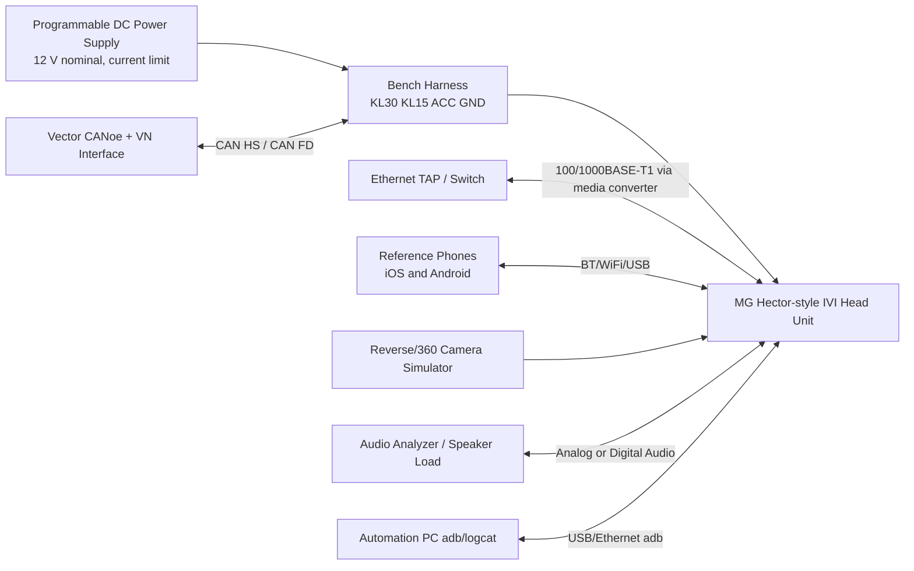
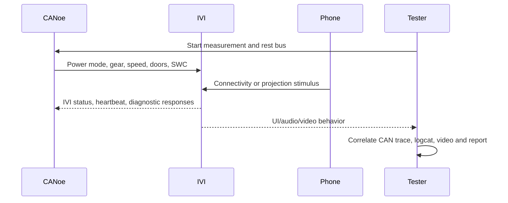

# Bench Setup Diagrams: Boot Time Analysis

## Infotainment Validation Bench

## Data and Evidence Flow

## Bench Safety Checklist

- Use current limit before first power-up.
- Verify pinout with continuity mode before connecting IVI.
- Use 120 ohm total CAN termination across CAN-H and CAN-L.
- Label every breakout: KL30, KL15, ACC, GND, CAN-H, CAN-L, Ethernet, USB and camera.
- Keep a known-good baseline trace for every bench.
