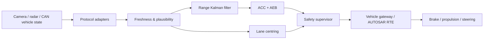

# Real-Time ADAS C++ Platform

Production-grade C++20 reference implementation for longitudinal and lateral ADAS software. Targets NVIDIA DRIVE / Qualcomm SA8xxx SoCs running QNX Neutrino with AUTOSAR Classic or Adaptive integration.

> **Safety notice:** This is an engineering starter platform, not a certified vehicle controller. A release requires ISO 26262 work products, cybersecurity analysis (ISO/SAE 21434), plant/HIL validation, calibrated parameters, independent safety monitoring, and target-specific verification.

---

## Feature scope

| Module | File(s) | Description |
|---|---|---|
| Adaptive Cruise Control | `controllers.hpp/cpp` | Time-gap policy + anti-windup PID |
| Autonomous Emergency Braking | `supervisor.cpp` | TTC / braking-distance envelope; dominant demand |
| Lane Keeping / Lane Centering | `controllers.hpp/cpp` | Rate-limited PID fallback |
| Predictive lateral control | `controllers.hpp/cpp` | Fixed-horizon FCS-MPC, bounded execution time |
| Vehicle Motion Control | `vehicle_dynamics.hpp/cpp` | Jerk-filtered speed PID, grade feed-forward, RK4 bicycle step |
| Sensor Fusion — ego state | `sensor_fusion.hpp/cpp` | CTRS Extended Kalman Filter; wheel-speed, yaw-rate, IMU updates |
| Sensor Fusion — range track | `estimation.hpp/cpp` | 2-state Kalman filter with Joseph-form covariance update |
| Safety supervisor | `supervisor.hpp/cpp` | Freshness, plausibility, fault bitmask, degradation modes |
| Real-time runtime shell | `runtime.hpp/cpp` | Deadline monitoring, WCET tracking, cycle health |
| Lock-free SPSC queue | `spsc_queue.hpp` | Allocation-free producer/consumer hand-off |
| CAN/CAN-FD codec | `can_codec.hpp/cpp` | Intel + Motorola byte order, range-checked encode/decode |
| SOME/IP service stub | `someip_stub.hpp/cpp` | In-process simulation; replace with vsomeip / ara::com |
| Diagnostic DTC manager | `diagnostics.hpp/cpp` | Two-trip confirmation, UDS-compatible snapshot |
| Structured trace logger | `diagnostics.hpp` | SPSC ring, 16-byte records, CANoe-exportable |
| QNX integration helpers | `qnx_integration.hpp/cpp` | PeriodicBarrier, RtThread config, clock abstraction |
| AUTOSAR RTE shim | `autosar_rte_shim.hpp` | Compile-tested stub; replace with generated RTE headers |

---

## Architecture



```mermaid
flowchart LR
    subgraph Sensors
        Radar[Radar track]
        Camera[Camera lane / obj]
        IMU[IMU ax/ay/gz]
        WheelSpeed[Wheel speed]
    end

    subgraph Adapters [Protocol adapters CAN / Eth / SOME-IP]
        CanCodec[CAN codec]
        SomeIp[SOME/IP stub]
    end

    subgraph Fusion [Sensor Fusion]
        RangeKF[Range Kalman filter]
        EgoEKF[Ego-state EKF]
    end

    subgraph Control [Control algorithms]
        ACC[ACC]
        AEB[AEB envelope]
        LCC[Lane centering MPC]
        VMC[Vehicle motion control]
    end

    Supervisor[Safety supervisor]
    Runtime[ControlRuntime — deadline monitor]
    Gateway[IVehicleGateway]
    Actuators[Brake / propulsion / steering]
    Diagnostics[DtcManager + TraceLogger]
    SomeIpOut[SOME/IP ControlStatus event]

    Sensors --> Adapters --> Fusion
    Fusion --> Control
    Control --> Supervisor
    Supervisor --> Runtime --> Gateway --> Actuators
    Runtime --> Diagnostics
    Gateway --> SomeIpOut
```

The **core library** has no OS dependency, no socket, no AUTOSAR header, and no dynamic allocation. This keeps timing deterministic and the test harness OS-independent. All platform specifics live in thin adapter layers.

---

## Build

Requires CMake ≥ 3.21 and a C++20 compiler (GCC ≥ 12, Clang ≥ 15, MSVC 2022).

```bash
# Configure and build
cmake -S . -B build -DADAS_BUILD_TESTS=ON
cmake --build build --parallel

# Run all tests
ctest --test-dir build --output-on-failure

# With sanitizers (host dev/CI)
cmake -S . -B build_san -DADAS_ENABLE_SANITIZERS=ON -DADAS_BUILD_TESTS=ON
cmake --build build_san && ctest --test-dir build_san

# With coverage (GCC)
cmake -S . -B build_cov -DADAS_ENABLE_COVERAGE=ON -DADAS_BUILD_TESTS=ON
cmake --build build_cov && ctest --test-dir build_cov
lcov --capture --directory build_cov --output-file cov.info

# Run 50 Hz demo
./build/adas_demo
```

---

## Real-time contract

| Parameter | Value | Notes |
|---|---|---|
| Control frequency | 50 Hz (20 ms) | Configurable; worst-case execution must fit inside deadline |
| Max frame age | 100 ms | Configurable in `AdasConfiguration::max_frame_age` |
| Max dt accepted | 100 ms | Supervisor rejects dt > 0.1 s |
| SPSC queue capacity | 1024 frames | `TraceLogger`; 8 for `SpscQueue<SensorFrame>` usage |
| MPC prediction horizon | 12 steps | 5 candidates → ≤ 60 state updates per cycle |
| EKF state size | 5 | x, y, ψ, v, ψ̇ |

`ControlRuntime::run_cycle()` measures WCET and records deadline misses in `CycleHealth`. On a deadline miss the command is dropped to Standby so the actuator receives a safe zero demand.

On QNX, the adapter schedules `run_cycle()` using `PeriodicBarrier` at `SCHED_FIFO` priority with CPU affinity. See [Platform Adapters](docs/PLATFORM_ADAPTERS.md).

---

## Documentation

| Document | Content |
|---|---|
| [Control and estimation design](docs/CONTROL_DESIGN.md) | PID, MPC, Kalman filter, vehicle dynamics math |
| [Platform adapters](docs/PLATFORM_ADAPTERS.md) | QNX, AUTOSAR Classic, AUTOSAR Adaptive, CAN, Ethernet, SOME/IP, CANoe |
| [Integration and safety](docs/INTEGRATION_AND_SAFETY.md) | ICD table, gateway checklist, safety case checklist |
| [Verification strategy](docs/VERIFICATION.md) | Unit, SIL, HIL, vehicle scenario families, release gates |
| [Trace event codes](docs/TRACE_CODES.md) | All structured trace events, usage example |
| [English–Chinese interface contract](docs/INTERFACE_CONTRACT_BILINGUAL.md) | Signal table, terminology, collaboration norms |
| [CANoe/CAPL scenarios](capl/adas_canoe_scenarios.can) | ACC, AEB, LKA, cut-in, fault-injection, override, stop-and-go |
| [CI/CD pipeline](.github/workflows/ci.yml) | GitHub Actions: GCC+ASan, Clang, clang-tidy, lcov coverage |


A deterministic C++20 reference implementation for longitudinal and lateral ADAS control. It contains an ACC/AEB controller, lane-centering controller, two-state Kalman range estimator, actuator safety envelope, transport abstraction, demo task, and executable tests.

> **Safety notice:** This is an engineering starter platform, not a certified vehicle controller. Do not connect it to a production vehicle or use it as the sole control path. A release requires ISO 26262 work products, cybersecurity analysis, plant/HIL validation, calibrated parameters, independent safety monitoring, and target-specific verification.

## Implemented scope

| Capability | Implementation |
|---|---|
| Adaptive cruise control (ACC) | Time-gap policy plus PID speed controller |
| Autonomous emergency braking (AEB) | TTC / braking-distance envelope; dominant deceleration request |
| Lane keeping / lane centring | Preview-error PID with steering-rate limiting |
| Predictive lateral control | Fixed-horizon, finite-control-set MPC with bounded execution time |
| Sensor fusion | Constant-velocity, two-state discrete Kalman filter for a lead track |
| Vehicle dynamics protections | Acceleration, deceleration, steering angle, and steering-rate constraints |
| Vehicle integration seam | `IVehicleGateway` / `ITransport` interfaces for CAN, Ethernet, and SOME/IP adapters |
| Real-time execution | OS-neutral `ControlRuntime`, deadline monitoring, and allocation-free SPSC queue |
| Degradation | Stale/implausible frames, invalid configuration, unavailable actuators, and driver override produce explicit fault state |

## Architecture



The control core has no operating-system, socket, CANoe, or AUTOSAR dependency. This makes it unit-testable and keeps transport failures outside the safety decision logic. Target adapters own message decoding, CRC/counters, endianness, deadline monitoring, and the platform-specific scheduling policy.

## Build and verify

Requires CMake 3.21+ and a C++20 compiler.

```text
cmake -S . -B build -DADAS_BUILD_TESTS=ON
cmake --build build --parallel
ctest --test-dir build --output-on-failure
./build/adas_demo
```

For host hardening, add `-DADAS_ENABLE_SANITIZERS=ON` when using Clang or GCC. The core builds without third-party run-time dependencies.

## Real-time contract

The demo runs a 50 Hz task (20 ms). On QNX, place the `step()` execution in a periodic high-priority thread, use a monotonic clock, pre-allocate all buffers, lock memory where approved by system policy, and avoid dynamic allocation, blocking I/O, logging, and locks in the control task. Transport receive threads should publish immutable, timestamped snapshots through a bounded single-producer/single-consumer queue.

`AdasSupervisor::step()` accepts the frame timestamp, current time, and measured task period. It rejects frames over 100 ms old and periods outside $(0, 100]$ ms. Parameter values are deliberately conservative examples and must be calibrated against the target vehicle, tyres, brake system, steering system, and ODD.

`ControlRuntime` measures each cycle, stores the worst execution time, detects deadline violations, and writes a non-control command if its configured deadline is missed. It does not create threads or set priorities: those actions belong to the QNX/AUTOSAR integration layer. `SpscQueue` is provided for the one-producer/one-consumer sensor-to-control hand-off; do not use it with multiple producers or consumers.

## QNX integration

1. Build the library with the QNX SDP cross compiler and target sysroot.
2. Implement `IVehicleGateway` in the platform layer; receive CAN/CAN-FD through the qualified driver stack and Automotive Ethernet/SOME-IP through the approved middleware.
3. Decode protocol data into `SensorFrame` only after alive-counter, CRC, range, and timestamp checks.
4. Pin the control task to an isolated CPU where the platform design permits; assign a fixed-priority scheduling policy and verify worst-case execution time under load.
5. Send `ActuatorCommand` to a separate guarded gateway that applies E2E protection, actuator enable conditions, command sequence counters, and watchdog supervision.
6. Route diagnostics and trace logging off the real-time path. Validate release-to-release timing with QNX tracing tools.

A QNX adapter must use the project safety concept—not this reference alone—to define fail-silent/fail-operational behavior, watchdogs, restart policy, and freedom-from-interference controls.

## AUTOSAR mapping

### Classic Platform

Map the supervisor to an application SWC with receiver ports for vehicle state, object list, and lane model; map its sender port to an actuator-arbitration SWC. The generated RTE invokes the 20 ms runnable. CAN/Ethernet signals remain in BSW/COM, with E2E and deadline supervision configured in the appropriate stack layers. Do not expose raw network frames to the control runnable.

### Adaptive Platform

Deploy the control application as a supervised Adaptive application. Bind the gateway adapter to ara::com service interfaces (commonly SOME/IP), use Execution Management for lifecycle, Persistency only outside the control loop, and Health Management for supervision. Preserve the same timestamp and freshness contract at the service boundary.

## CANoe validation workflow

Use CANoe/CAPL to replay nominal, cut-in, hard-braking lead, dropped-frame, invalid-counter, lane-loss, driver-override, and actuator-unavailable scenarios. Measure message latency and the command response at the gateway boundary. Export traces for review; do not treat desktop simulation results as HIL or vehicle validation evidence.

## Further documentation

- [Integration and safety guide](docs/INTEGRATION_AND_SAFETY.md)
- [Platform adapter guide](docs/PLATFORM_ADAPTERS.md)
- [Bilingual interface contract](docs/INTERFACE_CONTRACT_BILINGUAL.md)
- [Control and estimation design](docs/CONTROL_DESIGN.md)
- [Verification strategy](docs/VERIFICATION.md)
- [Project contribution guide](CONTRIBUTING.md)
