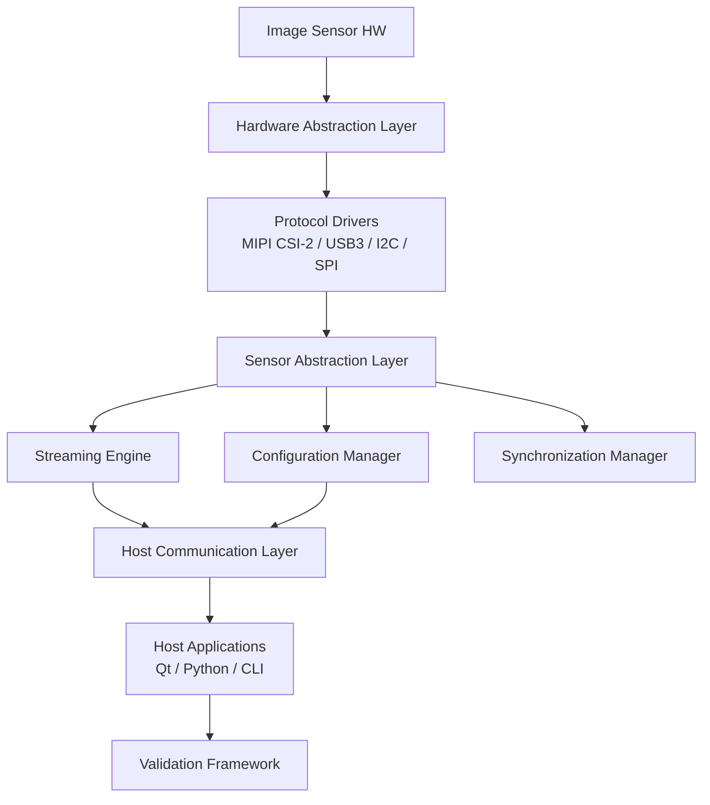

# Industrial Image Sensor Firmware Platform
### Production-Grade Embedded Firmware Ecosystem

A complete, production-ready firmware platform for industrial image sensors supporting MCU, FPGA, SoC, and Linux environments.

## Platform Architecture



## Supported Hardware

| Category | Supported Platforms |
|---|---|
| MCU | STM32, NXP i.MX RT, TI Sitara, Renesas RZ |
| SoC | NVIDIA Jetson, NXP i.MX 8, RaspberryPi CM4 |
| FPGA | Xilinx Zynq/Artix, Intel MAX10/Cyclone |
| Sensor I/F | MIPI CSI-2, USB3 Vision, I2C, SPI, Ethernet |

## Quick Start

```bash
# Clone and configure
git clone https://github.com/your-org/image-sensor-fw.git
cd image-sensor-fw
cmake -S . -B build -DTARGET_PLATFORM=STM32H7 -DCMAKE_TOOLCHAIN_FILE=cmake/arm-gcc.cmake
cmake --build build --parallel

# Run host-side tests
pip install -r validation/requirements.txt
pytest validation/tests/ -v --html=reports/results.html
```

## Repository Structure

```
image_sensor_platform/
├── firmware/           # Embedded firmware (C, C++)
│   ├── hal/            # Hardware Abstraction Layer
│   ├── drivers/        # Protocol and peripheral drivers
│   ├── sensor/         # Sensor abstraction and management
│   ├── streaming/      # DMA streaming engine
│   ├── diagnostics/    # Logging, health monitoring
│   ├── bootloader/     # Secure bootloader
│   └── middleware/     # RTOS wrappers, memory manager
├── linux_driver/       # Linux V4L2 and media framework
├── fpga/               # FPGA interface IP cores
├── host/               # Host-side software
│   ├── qt/             # Qt GUI application
│   ├── python/         # Python SDK and CLI tools
│   └── cli/            # Command-line utilities
├── validation/         # Automated test framework
├── docs/               # Architecture and API documentation
└── ci/                 # CI/CD pipeline configurations
```

## Documentation Index

- [Architecture Design](docs/ARCHITECTURE.md)
- [Driver Development Guide](docs/DRIVER_GUIDE.md)
- [Sensor Integration Guide](docs/SENSOR_INTEGRATION.md)
- [Validation Guide](docs/VALIDATION_GUIDE.md)
- [API Reference](docs/API_REFERENCE.md)
- [Interview Preparation](docs/INTERVIEW_GUIDE.md)
